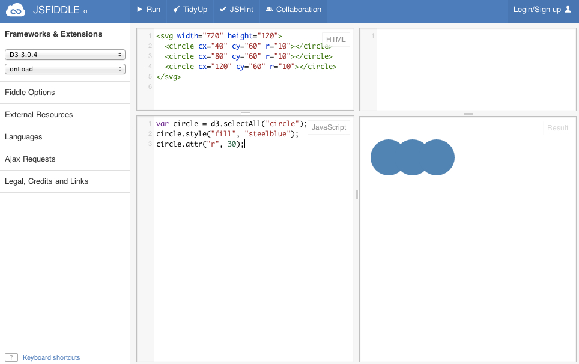
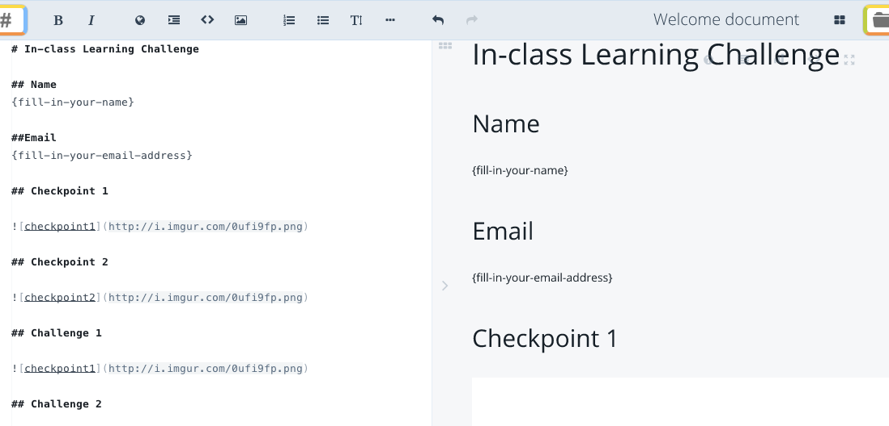
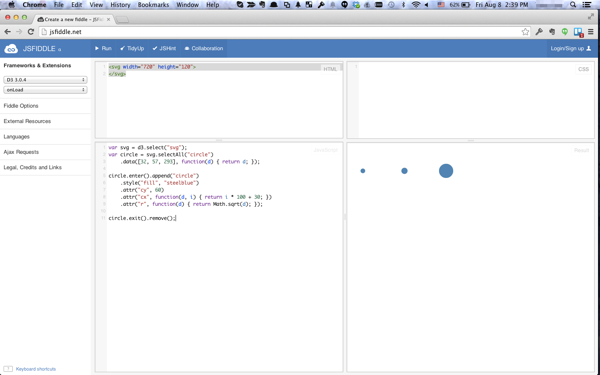

__Time: 30 minutes__

# Learning 

This introductory learning challenge is based on D3. Your challenge is to learn as much about D3 as you can from this tutorial article "[Three Little Cricles](http://bost.ocks.org/mike/circles/)" written by Mike Bostock.

In the article, you will encounter a bunch of HTML5 code and JavaScript code. Use [JSFiddle](http://jsfiddle.net/) to try the code out. Once you visit JSFiddle, you will see places for you to copy and paste code snippets. You can hit run to see the results, like below.

Hint: Make sure you select the right library from the dropdown boxes under Frameworks & Extensions.

# Journal

As you are going through the tutorial article, we want you to document the process your learning by keeping a simple journal. You will use the [Markdown](http://en.wikipedia.org/wiki/Markdown) text formatting syntax to write this journal and submit it to [Github](http://www.github.com).

But for the purpose of this exercise, use [Stackedit](https://stackedit.io/), an online Markdown editor. Copy and paste the template text below to the online editor.


# In-class Learning Challenge

## Name
fill-in-your-name

##Email
fill-in-your-email-address

## Checkpoint 1

## Checkpoint 2

## Challenge 1

## Challenge 2

## Two Questions

Write down your answers to TWO questions. For the rest, think about them and be ready to discuss in class.

### What does D3 stand for?
type-your-answer

### What is the big deal about D3?
type-your-answer

### Who is Mike Bostock?
type-your-answer

### In the expression _function(d) { return Math.sqrt(d); }_, can _d_ be replaced by another variable name such as _t_? Why or why not?
type-your-answer

### Which sentence or paragraph in the tutorial article is impossible to understand and can be skipped for now? 
type-your-answer



After you have pasted the template to the ditor, you should see something like below. Begin filling in your name and address.

# Checkpoints

As you are going through the tutorial, you will see several intermediate outputs. We've selected two as checkpoints to measure your learning progress. 

<button type="button" class="small blue">Checkpoint 1</button> The first checkpoint is when you see four cicles likes below.

__Checkpoint 1__: The first checkpoint is when you see four cicles likes below.

__Checkpoint 2__: Then, toward the end, the final checkpoint is when you see three circles like below.

Each time you reach a checkpoint, take a full desktop screenshot. Make sure your screenshot includes as much of the JSFiddle interface as possible and also the system time in your menu bar or task bar. In the future we may ask you to submit code too, but not right now.

Here is an example full desktop screenshot.

How are screenshots submitted? You will use [Github](http://github.com) to submit screenshots too. But for the purpose of this introductory exercise, use [Imgur](http://imgur.com/). Upload the two checkpoint screenshots to Imgur, a free and simple image sharer. After uploading, you will get an URL to each uploaded image (e.g., [http://imgur.com/NVuxUdt](http://imgur.com/NVuxUdt)). You can easily infer the absolute URL to this image (e.g., [http://i.imgur.com/NVuxUdt.png](http://i.imgur.com/NVuxUdt.png)). Then, you can enter this URL to your journal at the appropriate place. 

# Challenges

One way to show you have indeed learned a new skill is to apply that skill to a novel problem. You can make three or four blue circles just as what the tutorial article has demonstrated. That's great! But we want to challenge you to do something new.

__Challenge 1:__ Draw 10 circles.

__Challenge 2:__ Make the four circles red. Reverse the horizontal order so that the leftmost circle is the biggest.

# Study Questions

Next, we want to give you a few study questions to help you learn more.

1. What does D3 stand for?
2. What is the big deal about D3?
3. Who is Mike Bostock?
4. In the expression _function(d) { return Math.sqrt(d); }_, can _d_ be replaced by another variable name such as _t_? Why or why not?
5. Which sentence or paragraph in the tutorial article is impossible to understand and can be skipped for now? 

Write down your answers to TWO of them. Think about the others and be ready to discuss them in class.

# Submission

You should by now have filled out the journal template with links to screenshots and answers to a subset of the study questions. You will use [Github](http://github.com) to submit. Normally, you will use a Github repository to handle all of your submissions (you will be given this respository later). But for now, you will simply create a [Gist](https://gist.github.com/). Fortunately, StackEdit, the online editor you are using for this challenge, provides a feature to help you post your Markdown text directly to Gist. Explore the interface of StackEdit and see if you can find that feature.

The final step, normally, would be to __push__ your repository. But for now, you have a Gist. We will use a Google Document to collect this Gist from everyone in the class. Follow this link to this collection document. Enter your name and the URL to your gist. You will also get to see others' gists and find out what others have done.

