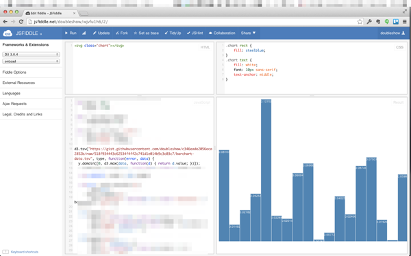
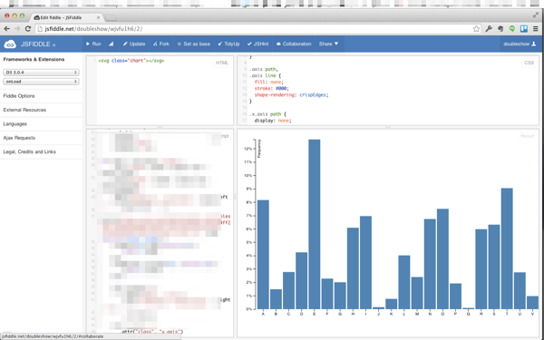
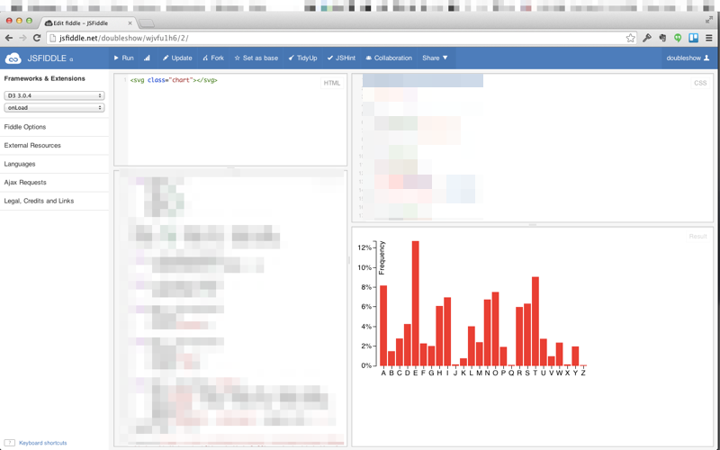
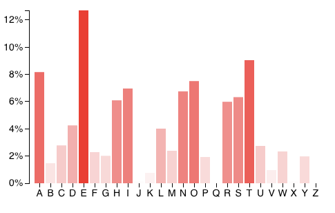

# Prerequisites

* Create a [Github](http://www.github.com) account (for submitting your work).
* Create a [Disqus](http://www.disqus.com) account (for asking questions and participating in discussion about each learning topic on our course website).
* Complete a pre-class survey (for letting the teaching staff know more about your background and learning objectives).

# Units

This week's learning challenge has two units:





[{{ unit.name }}]({{ unit.url }})



# Show and Tell

Find a recent article about big data. Be ready to tell the class why this article is interesting.

# Grading

Each week's learning challenge is worth 100 points. The distribution of the points are specified in the learning journal (see next). 

# Journal

A template has been created for you to keep a learning journal for this week. This template is in the form of a Git repository. 

The link to the repository is: [https://github.com/CSCI-4830-002-2014/challenge-week-1](https://github.com/CSCI-4830-002-2014/challenge-week-1)

1. To start, [**fork** ][forking] the repository.
1. [**Clone**][ref-clone] the repository to your computer.
1. Modify the files and [**commit**][ref-commit] changes to complete your solution.
	* README.md is the template file. Edit your name. Enter your answers to the study questions. Enter JSFiddle links...etc.
	* The images in the folder are placeholder images. Replace them with your own screenshot images.
1. [**Push**][ref-push] the changes up to GitHub.
1. Create a [**pull request**][pull-request] on the original repository to turn in the assignment.

If you are not familair with Github enough to go through this process, please seek help. 

* Go to the TA's office hours.
* Go get help from one of the LAs.

<!-- Links -->
[create-repo]: https://help.github.com/articles/create-a-repo
[private-repos]: /guide/private_repos
[add-to-team-action]: https://github.com/education/teachers_pet/#giving-others-access
[teachers-pet]: https://github.com/education/teachers_pet
[help-add-to-team]: https://help.github.com/articles/adding-organization-members-to-a-team
[help-access-control]: https://help.github.com/articles/what-are-the-different-access-permissions#organization-accounts
[forking]: https://guides.github.com/activities/forking/
[ref-clone]: http://gitref.org/creating/#clone
[ref-commit]: http://gitref.org/basic/#commit
[ref-push]: http://gitref.org/remotes/#push
[pull-request]: https://help.github.com/articles/creating-a-pull-request
[raw]: https://raw.githubusercontent.com/education/guide/master/docs/forks.md

<!-- After you've  -->

<!-- ## Checkpoint 3

The third checkpoint is when you've completed the section [Rotating into Columns](http://bost.ocks.org/mike/bar/3/#columns) in the article [Let’s Make a Bar Chart, III](http://bost.ocks.org/mike/bar/3/). Take a full screenshot and submit it. It should look something similar to below.

The data you need for this article is provided below for your convenience. You will need to create a text file containing this data and host it somewhere (e.g., Gist), like in the previous checkpoint. 

<pre>
name	value
A	.08167
B	.01492
C	.02782
D	.04253
E	.12702
F	.02288
G	.02015
H	.06094
I	.06966
J	.00153
K	.00772
L	.04025
M	.02406
N	.06749
O	.07507
P	.01929
Q	.00095
R	.05987
S	.06327
T	.09056
U	.02758
V	.00978
W	.02360
X	.00150
Y	.01974
Z	.00074
</pre>

## Checkpoint 4

The fourth checkpoint is when you've reached the end of the article [Let’s Make a Bar Chart, III](http://bost.ocks.org/mike/bar/3/). Take a full screenshot and submit it. It should look something similar to below.

 -->

<!-- ## Challenges

__Challenge 1:__ Make the chart smaller. Enlarge the text. Reduce the number of ticks. Change the color of the bars to red. The result should look like below.

 

__Challenge 2:__ 


var max = d3.max(data, function (d) {
        return d.value;
});

and


.attr("opacity", function(d) { return d.value / max });


 -->

