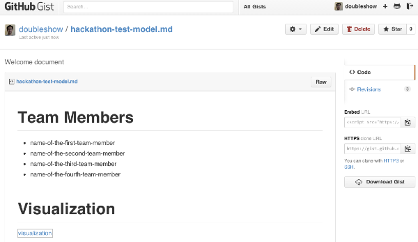

# Dataset

__Millennium Development Goals__

Relevant indicators drawn from the World Development Indicators, reorganized according to the goals and targets of the Millennium Development Goals (MDGs).

[www](https://docs.google.com/spreadsheets/d/146ctCoy885JvnlyT2a_t5cobAB0hdjPVDpubsjQ4_Eo/pubhtml) | [xls](World.xls)

(Source: World Bank)

# Objective

Create visualizations to help people understand the progress made over the past 20 years toward the MDGs

# Timeline

| Overview | 5 minutes |
| Hacking | 30 minutes |
| Presentation | 15 minutes |

# Prerequisites

* [Introductory learning challengee](/challenges/0)

# Requirements

1. Use D3 as the data visualization tool.
2. Use a series of cricles as the visualization (since it is the only thing you've learned so.
3. Use JSFiddle as the code editor.
4. The visualization must have some title and text commentary.
5. The visualization must have more than two rows of circles. Each row represents a different measure.

# Team

Form a team of four with other classmates. Naturally you should work with others who are already sitting at the same round table. The teaching staff will walk around to facilitate team forming.

# Deliverables

* A screenshot only of the D3 visualization you've created.
* A link to a saved JSFiddle page containing your code

# Submission

Use the Markdown template below to create a submission document.

<pre>

# Team Members

* name-of-the-first-team-member
* name-of-the-second-team-member
* name-of-the-third-team-member
* name-of-the-fourth-team-member

# Visualization

# JSFiddle

[See our D3 code on JSFiddle](url-to-your-jsfiddle-page)

</pre>

Use JSFiddle's save function to save your code. Write down the URL (e.g., [http://jsfiddle.net/2t4hL48c/](http://jsfiddle.net/2t4hL48c/)). In the introductory learning challenge, you used [StackEdit](https://stackedit.io/), an online Markdown editor. You can use it again. Or you can use your favorite Markdown text editor. For screenshots, you can use [Imgur](http://imgur.com/) or any other online image hosting service. 

Publish your submission document as a Gist, like below.

Follow the link below to open the shared Google Sheet. Type the link to your Gist and the names of your team to this sheet.

		
		&nbsp;
<a href="https://docs.google.com/spreadsheets/d/1sA9pBLknhCXSfb4VcLou0xI1kVXLx120KeN4kbxtZlY/edit#gid=0">Submission Spreadsheet</a>

# Presentation

After the time is up and all teams have submitted their deliverables, each team will take turn presenting the visualization the team has created. This presentation will be done in a "lightening talk" style. Each team will get only 1 minute to present. Depending on the time, not all teams may get to present. But every team should be prepared to do so when being called upon.

The presentation should focus on three talk points:

1. What does the visualization show?
2. Why is it shown this way?
3. What is the one most interesting thing highlighted by this visualization?