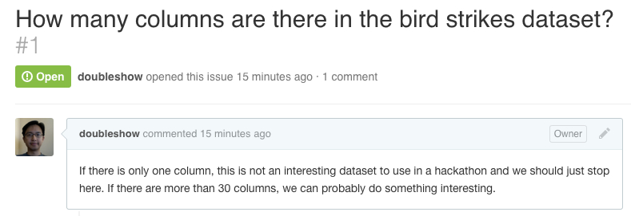
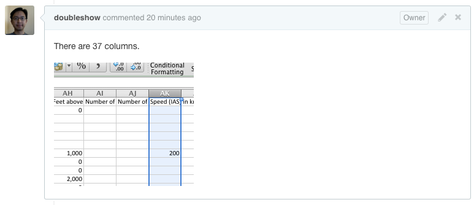

# Timeline

| Show & Tell | 20 minutes |
| Hackathon (Round 1) | 40 minutes |
| Presentation | 20 minutes |
| Hackathon (Round 2) | 40 minutes |
| Presentation | 20 minutes |
| Project | 10 minutes |
| Total | 150 minutes |

# Dataset

| [Bird Strikes](Bird Strikes.xlsx) |

Source: [FAA Wildlife Strike Database](http://wildlife.faa.gov/)

# Repository

| [https://github.com/CSCI-4830-002-2014/hackathon-birdstrikes](https://github.com/CSCI-4830-002-2014/hackathon-birdstrikes) |

This week, we will use the issue tracker of this repository to manage submissions. In other words, we will all use the same repository. No fork and pull is required.

# Objective

1. Ask insightful questions about bird strikes
2. Answer them by creating visualization

# Prerequisites

* [Week 5 Learning Challenge](/challenges/5)

# Team

This week, team assignments are predetermined. Check the hackathon Git repository to find your team.

# Objective 1: Ask Questions

Discuss among the team to come up with a list of N questions that may shed some light on bird strikes in aviation (N = number of team members). For each question, speculate on at least two possible __outcomes__. For each outcome, speculate on its implication in terms of some __actionable items__. 

Submit each question as an issue in the hackathon Git repository. Write your explanation (outcomes + actionable items) in a few sentences in the description of the issue.

Below is an [example of a question:](https://github.com/CSCI-4830-002-2014/hackathon-birdstrikes/issues/1)

# Objective 2:  Answer by Visualizations

Pick N questions from other teams (N = number of team members). Work together as a team to find answers. Do not answer your own questions. Create visualizations to backup your answers, using any tool you want (e.g., Tableau, Splunk). Submit answers by leaving comments to issues and attaching images of the visualization you created.

Below is an [example of an answer:](https://github.com/CSCI-4830-002-2014/hackathon-birdstrikes/issues/1#issuecomment-57184700)

It is okay if two teams happen to work on the same question.

# Rounds

The hackathon time will be divided into two rounds. During each round, your team should concentrate on two or three questions, rather than trying to answer them all.

# Presentations

After each round, we will take turns to let each team present. Other teams and the teaching staff may add follow-up questions (in the form of further comments to the issue).
