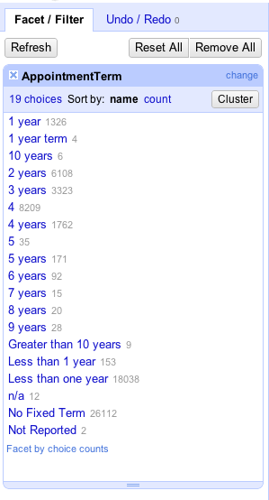
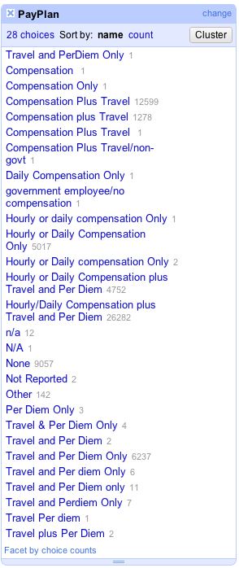

# Timeline

| Show & Tell | 20 minutes |
| Project | 10 minutes |
| Hackathon | 100 minutes |
| Presentation | 20 minutes |
| Total | 150 minutes |

# Dataset

[Federal Advisory Committee Dataset](FACAMemberList2004.csv)

[Musicians Dataset](Musicians.csv)

# Objective

1. Clean up the Federal Advisory Committee Dataset
2. Clean up the Musician Dataset and find out if the "27 club" is real

# Prerequisites

* [Week 4 Learning Challenge](/challenges/4)

# Team

Form a team of four or five with other classmates. You should work with others who are already sitting at the same table. The teaching staff will walk around to facilitate team forming. Introduce yourself if you do not already know each other.

# Objective 1: Clean up the Federal Advisory Committee Dataset

The data in the AppointmentTerm and PayPlan columns are in dire need of some cleaning.

Submit screenshots of the Facet/Filter widget above that displays your cleaned up data.

In addition, create one visualization (e.g., Bar Chart or Pie Chart) to present your results. You can use any software you already know how to use (e.g., Excel).

# Objective 2: Clean up the Muscian Dataset

Your goal is to figure out "Is the 27 club real?"

This question is based on [this section](http://enipedia.tudelft.nl/wiki/Google_Refine_Tutorial#More_Data_Sets_-_Is_the_27_Club_Real.3F) of the Google Refine tutorial you worked on. It provides some tips on how you should clean up this data.

Write a short sentence to explain your answer. Add a visulziation to support your answer.

# Presentation

Your team will do a 5 minutes presentation to the entire class about the findings from your analyses.

# Submission

[Github submission template](https://github.com/CSCI-4830-002-2014/hackathon-cleanup)

Use a Github repository to submit your work. Follow [this link](https://github.com/CSCI-4830-002-2014/hackathon-cleanup) to find the template repository for this hackathon. Fork, modify, commit, push, and make a pull request, just like what you did for your other homework submissions.

