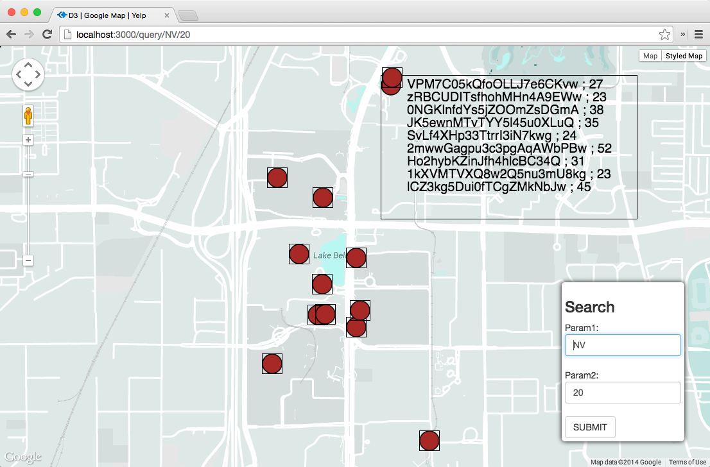
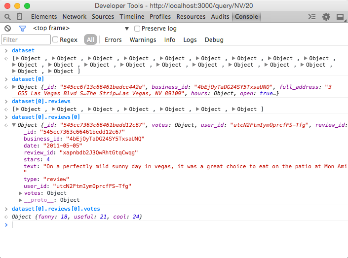

# Timeline

| Guest Presentation (NetApp) | 15 minutes |
| Project | 5 minutes |
| Proposal  | 20 minutes |
| Hackathon | 100 minutes |
| Presentation | 10 minutes |
| Total | 150 minutes |

# Dataset

| [Yelp Data Challenge](http://www.yelp.com/dataset_challenge)  |

You will need to have already loaded ALL the data into a Mongodb server.

# Repository

| [https://github.com/CSCI-4830-002-2014/hackathon-d3map](https://github.com/CSCI-4830-002-2014/hackathon-d3map) 

# Objectives

Create Custom Map Visualization for Yelp Reviews

1. Warmup
2. Customization

# Prerequisites

* [Week 11 Learning Challenge](/challenges/11)

# Team

Team assignment will be facilitated by the teaching staff.

# Stater Program

You are given a starter program for this hackathon. Clone the repository to get this program. The program is a Node.js server that generates the visualization below:

It has a form that takes two parameters. The first parameter is the state. The second parameter is the "minimum number of _useful_ votes" for the retrieved reviews. The default parameter values retrieve 10 businesses together with reviews that have at least 20 _useful_ votes (filtering out not so useful reviews).

Take a moment to read the program to understand how it works.

In _app.js_, pay attention to how _async.map_ is used to retrieve reviews from each business in an array using a separate MongoDB query. Also, see how the reviews are added to each business as an extra property.

To test if the data is loaded correctly, you are encouraged to use the JavaScript console and type the expressions like below:

In the d3 template (business_map.html), pay attention to the code inside "marker.each" and how a "text" element is generated for each review. For instance, if 4 reviews are retrieved for a particular business, 4 text elements are created and added to the marker.

# Objective 1: Warmup

Get the starter code to work. Add the same enhancements you've done during previous week's D3 learning challenge. These enhancements are:

1. Represent _star_rating_ using the color of each marker
2. Represent _review_count_ using the size of each marker

# Objective 2: Customization

Work a team, discuss a number of ways to customize and enhance this search interface. Be creative!  

Think in terms of technology, you can discuss:

1. Modify the query interface
2. Modify the D3 visualization
3. Modify the Node.js server

Think in terms of analyses, you can discuss:

1. What new questions you want to answer?
2. What new ways to visualize the data to make it easier to understand?

# Proposal

Write a brief description of the customizations your team intend to make. Each team member should be responsible for implementing ONE enhancement. 

# Implementation

It is quite possible some of the ideas your team came up with might not nicely merge into a single project. It is fine to maintain multiple branches as you implement.

# Deliverables

* For each customization or enhancement, submit a couple representative screenshots to illustrate.
* Submit your implementation (i.e., commit changes and make a pull request). If your team is unable to come up with a single implementation, it is okay to submit multiple pull requests, one for each implementation.

# Presentation

Your team will do a 3-5 minute presentation to the entire class about your findings.

# Submission

Use a Github repository to submit your work. Follow [this link](https://github.com/CSCI-4830-002-2014/hackathon-d3map) to find the template repository for this hackathon. Fork, modify, commit, push, and make a pull request.

