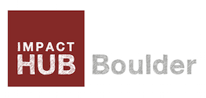

# Location

This week's hackathon is in partnership with [Impact Hub Boulder](http://www.impacthubboulder.com), a co-working space in Boulder for entrepreneurs and professionals to collectively create positive impact in the world.

	> 1877 Broadway, Suite 100
	> Boulder, CO 80302

Please arrive by 6:30 PM. We will be located in the South Side space. Enter the building from Broadway and go downstairs. Once inside, turn left to get to the South Side space.

# Timeline

| Intro to Hub & Logistics | 5 minutes |
| Show & Tell | 10 minutes |
| Project | 5 minutes |
| Hackathon | 80 minutes |
| Presentation | 20 minutes |
| Total | 120 minutes |

# Dataset

* [Aid Data](https://data.itpir.wm.edu/aiddatascratch/aiddata/researchrelease/aiddata2_1_since_1996_csv.zip)
* GDELT [raw data site](http://data.gdeltproject.org/events/index.html)

# Repository

| [https://github.com/CSCI-4830-002-2014/hackathon-internationalaid](https://github.com/CSCI-4830-002-2014/hackathon-internationalaid) |

# Introduction

In the International Development community, there has been much debate about the effectiveness of aid. While the debate is much more complex, it boils down to these two approaches to ending world poverty:

* Increase aid spending and centralized top-down planning
* End aid spending and help local entrepreneurs build bottom-up solutions

# Objectives

1. Identify a two countries to compare.
2. Analyze events occurring within each country to develop a hypothesis on the effect of aid.
3. Bring in other data sets to help you with your hypothesis.

# Prerequisites

* [Week 7 Learning Challenge](/challenges/7)
* [MongoDB Unit II](/units/mongodb_2/)
* [MongoDB Unit III](/units/mongodb_3/)
* [GDELT Unit I](/units/gdelt_1/)

# Team

Form a team of four or five with other classmates. You should work with others who are already sitting at the same table.

# Objective 1

Aggregate aid data by country over the year 2013. Identify two [developing countries](http://data.worldbank.org/region/LDC) to compare. There should be a significant difference in aid amounts between the two countries. If possible, include one of the countries involved in the [Millennium Villages Project](http://millenniumvillages.org/the-villages/) as your "higher aid" country.

# Objective 2

Once you have picked your two countries, look at the aid disbursements in terms of the end date. Based upon these end dates, come up with what your team thinks is a good time range that will show the before & after events in the GDELT data set. One possible method of doing this analysis is by constructing a quick histogram of the dates in Tableau. You may need to pick certain aid projects to get a more defined before & after date. Once you decide on your time range, use the procedure covered in the [GDELT unit](/units/gdelt_1/) to download data from GDELT, merge, and import into MongoDB as a seperate collection for analysis.

Analyze the events that occurred within that country before and after aid and identify relevant trends. Visualize these trends in Tableau or D3.

# Objective 3

Based on gaps that you see in your analysis, find some data sets online that could help with your analysis. If you have time, dig into that data set to see if it can answer some of your remaining questions. Some places you can start are:

* [http://data.worldbank.org](http://data.worldbank.org)
* [http://data.un.org](http://data.un.org)
* [http://www.usaid.gov/data](http://www.usaid.gov/data)
* [http://opendataforafrica.org](http://opendataforafrica.org)
* [Google](http://www.google.com)!

# Analysis Questions

1. Which countries did you choose to compare? What are their aid totals?
2. What does the aid timeline look for each country?
3. What timeframe did you analyze and how did you pick that?
4. Are there trends in the events that occured before and after aid?
5. How did these trends differ between the "low aid" country and the "high aid" country?

# Discussion Questions

1. What are the limitations of this analysis?
2. How did your supplemental data sets help with these limitations?

# Deliverables

* A brief description of what you found
* Your team's hypothesis on the international aid debate
* Supporting charts and graphs

# Presentation

Your team will do a 3-5 minute presentation to the entire class about your findings.

# Submission

Use a Github repository to submit your work. Follow [this link](https://github.com/CSCI-4830-002-2014/hackathon-internationalaid) to find the template repository for this hackathon. Fork, modify, commit, push, and make a pull request.
