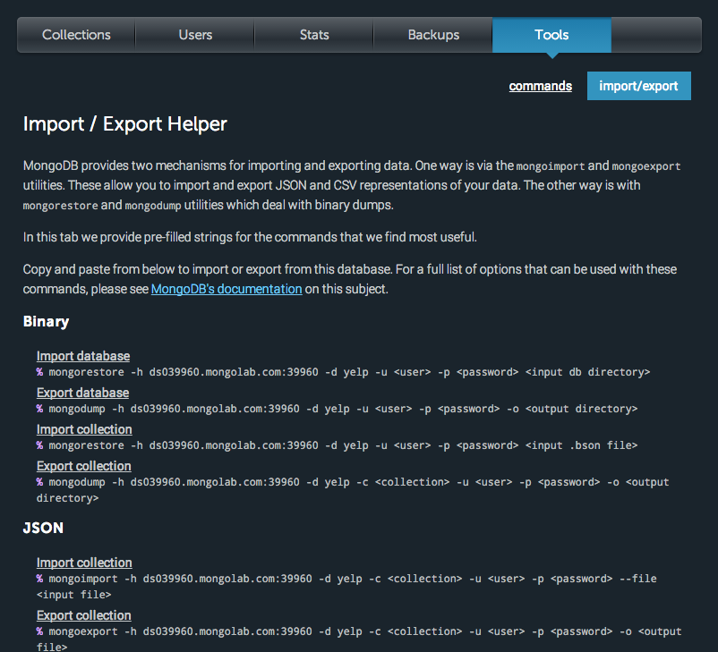
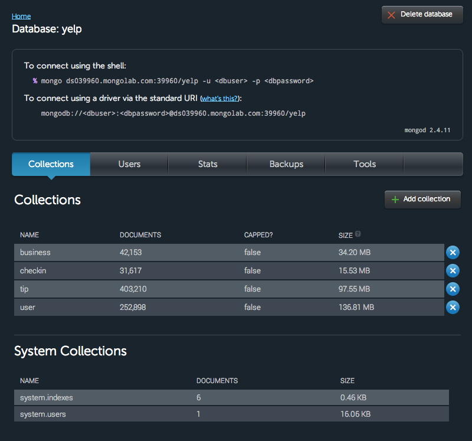
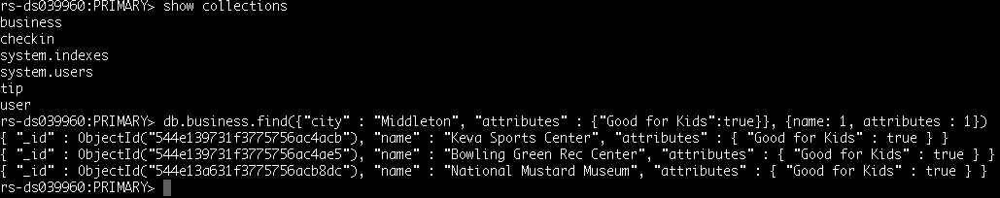
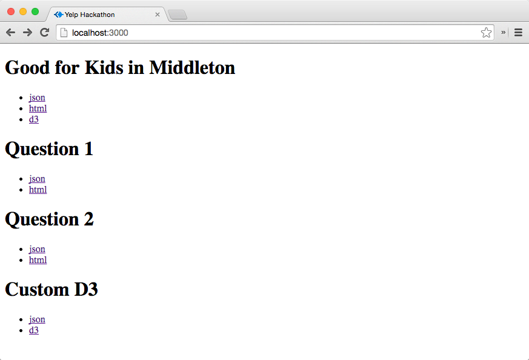
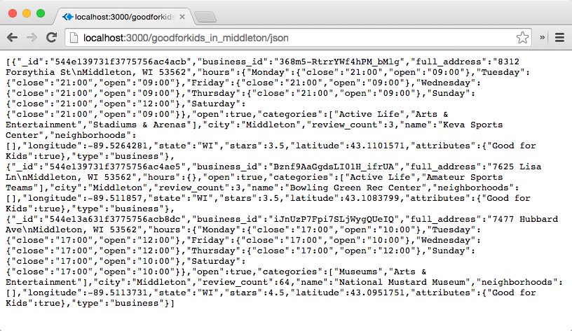
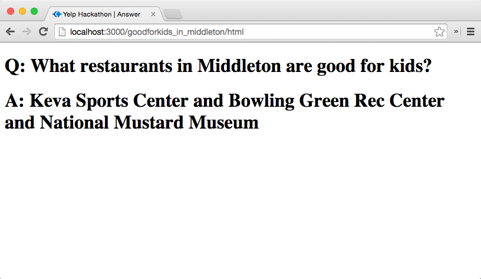
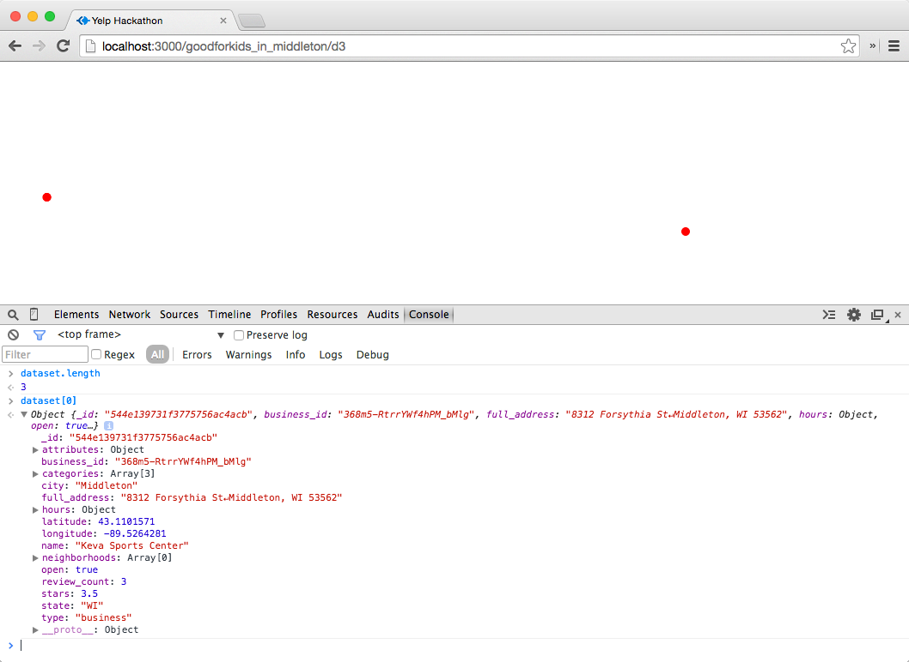
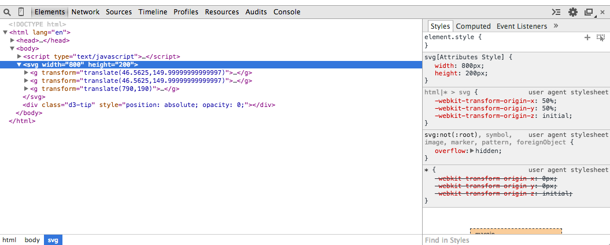
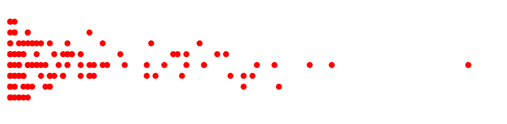

# Timeline

| Show & Tell | 10 minutes |
| Project | 10 minutes |
| Hackathon | 110 minutes |
| Presentation | 10 minutes |
| Total | 150 minutes |

# Dataset

| [Yelp Data Challenge](http://www.yelp.com/dataset_challenge)  |

Click the big red download button to start downloading.

# Repository

| [https://github.com/CSCI-4830-002-2014/hackathon-yelp](https://github.com/CSCI-4830-002-2014/hackathon-yelp) 

# Objectives

1. Ingest Yelp data into a MongoDB database hosted on MongoLab [https://mongolab.com/]
2. Query the database to ask interesting questions
2. Serve results of interesting queries using express.js
3. Create D3 visualization of the result of interesting queries

# Prerequisites

* [Week 9 Learning Challenge](/challenges/9)

# Team

The class will be divided into four teams. Team assignment will be facilitated by the teaching staff.

# Objective 1: Ingest

Download Yelp data, which has five datasets: business, tip, user, checkin and review, Use [MongoLab](https://mongolab.com/) to create a MongoDB database to store the data. The free tier of MongoLab provides 500MB. It is sufficient for storing the business", tip, user, and checkin (not review). Create four collections. 

Ingest data into your database. The "tools" tab of MongoLab's control panel provides some tip on how to do this.

If successful, you should see in the "Collections" tab the four collections listed.

Then, you should be able to connect to the database from a local terminal.

List all the collections. Then try a simple query to find restaurants in the city of Middleton that are good for kids, like this:

Submit a screenshot of your terminal output similar to above to demonstrate that your team has accomplished the data ingestion step.

# Objective 2: Query

For this objective, we will do something similar to the "bird strike" hackathon. Each person will contribute ONE interesting question and post it in the hackathon repository as an issue. You must have a rough idea how you may answer the question yourself, to keep it reasonable. 

After questions are posted, work as a team to tackle the questions raised by other teams. Post your answer as a comment. The answer should include (1) mongodb queries, (2) mongodb output, and (3) a short sentence explanation of the output.

# Objective 3: Serve

Write a simple web serve to serve the results of interesting queries. Your are provided with skeleton code as an example you can build upon. Clone the hackathon repository. Get the server code to run on a localhost. __You will need to enter the username, password, and the url to access the database on MongoLab.__ Open a browser and point it to http://localhost:3000. You want to be able to see something like this:

Open [json](http://localhost:3000/goodforkids_in_middleton/json) under Good for Kids in Middleton, you should be able to see:

Open [html](http://localhost:3000/goodforkids_in_middleton/html) under Good for Kids in Middleton, you should be able to see:

In _app.js_, modify the code for _q1_ and _q2_ to serve two of the questions your team came up with (which were answered by other teams). The lines marked by _TODO_ suggest where you may need to modify

After you are done, commit your changes to _app.js_.

Submit the content of the web pages served by the these links as screenshots:

1. [http://localhost:3000/q1/html](http://localhost:3000/q1/html)
2. [http://localhost:3000/q2/html](http://localhost:3000/q2/html)

# Objective 4: Visualize

Create a custom D3 visualization for an interesting query that returns lots of data points. After you got the skeleton code running on the localhost, open the link [d3](http://localhost:3000/goodforkids_in_middleton/d3) under the example question. You should see something like below. Use Chrome to examine the 'dataset' variable in the Javascript console. Make sure the data is properly loaded. There should be three items.

Also, examine that there are three _g_ elements corresponding to the three data items.

As a warm-up exercise, try to display ALL businesses in Middleton. Figure out where in _app.js_ you need to modify to produce a visualization like below.

Design a custom visualization for the interesting query you've picked. Draw a sketch first. Implement the visualization by modifying _views/custom.html_.

When you are done, commit your changes. Then, in the template (README.md), submit (1) a photo of your hand-drawn sketch, and (2) a screenshot of the visualization shown in a web browser.

