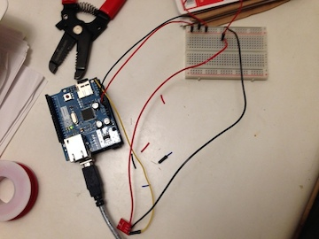
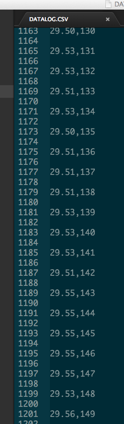

# Mini-Project Proposal

In our approach to learning about Big Data, we will use a mixture of hardware and software approaches for collecting data.  Since many of you may not have much experience making and deploying hardware, we will have a scaffolded set of projects and workshops to help you along.  Also, we will devote a small portion of class each week to helping you with any hardware troubleshooting and doing basic Q&A on the project.

As an introduction to the project component of the class, we will have you each build a single sensor piece of hardware using an arduino.  

Here is a picture of my prototype, which will be similar to yours:  
  
The yellow wire connects the sensor to the arduino, the red wire is the power source, and black the ground.

You will have a choice between creating a sound sensor or a light sensor.  We will also use an embedded SD card to collect the data.  Once you've built your sensor, you will have to deploy it somewhere to collect some sample data to clean and analyze.  For this first project you don't need to collect much data.  Here is a sample of data I collected from a prototype I made for determining noise levels in Norlin Library.  [The left column is the average volume above silence; the right column is indexing so I know how many samples were collected each time I turned it on.]

## Workshop

Since we have no class on labor day, we will instead be holding workshop sessions where you'll pick up your hardware and start building your sensor. 

__Time:__ Currently the sessions are scheduled for __Tuesday 9/2 2:30-4:30 PM__ and __Wednesday 9/3 5-7PM__.  You only have to attend one.  If both of these times are unable to work in your schedule, please tell one of the instructors (Tom Yeh or Mike Skirpan) BEFORE Friday 8/29 to work out receiving your hardware.

__Location:__ The location of the workshop will be announced soon.

##Proposal Submission

We've created a github repository containing a markdown template for your proposal.
Create a fork of the repository and make a pull request when you are ready to submit. 

[Project 1 - Proposal Github Repo](https://github.com/CSCI-4830-002-2014/project-1-proposal)
