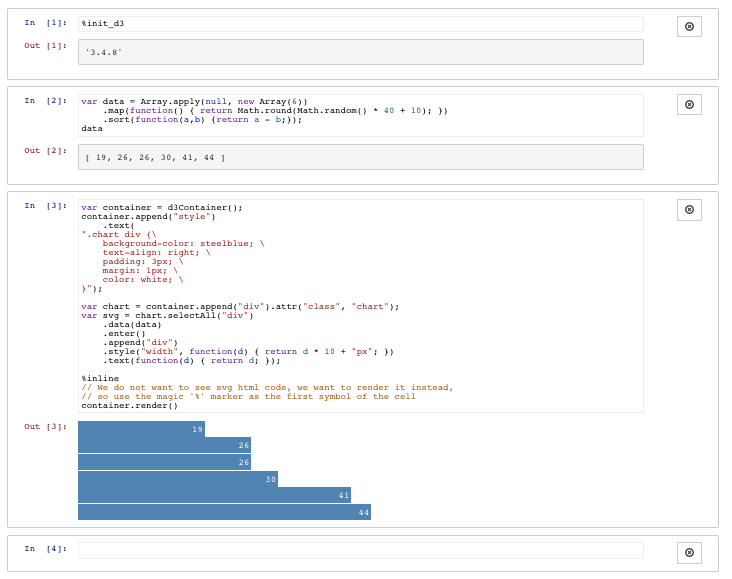

(This is a part of [week 5's learning challenge](/challenges/5/))

We are going to cover several useful JS libraries for anlaysis. This unit serves as a warm up exercise. 

# Checkpoints

## Checkpoint 1

Read about [gauss](https://github.com/wayoutmind/gauss), described as a "JavaScript statistics, analytics, and data library - Node.js and web browser ready. Get this library installed on your system. Go to the very bottom of the README.md page. Find the section titled [Using the REPL console](https://github.com/wayoutmind/gauss#using-the-repl-console). Get this example working on your computer. Take a screenshot to submit. 

## Checkpoint 2

Modify the example to use our own data. Use the [Olympic Athletes Dataset](OlympicAthletes_0.xlsx). Export the values in the "Age" column to a text file. Compute the max, min, and average age of the athletes. Take a screenshot to submit. 

## Checkpoint 3

Read about [i.js](https://github.com/mksenzov/i.js/tree/master). Get the D3: basic example working on your computer. You should see something like this.

Modify the code in the In [2] cell to increase the size of the data array to 10. Get the bar chart to show 10 bars instead of 5 bars. Take a screenshot to submit.

(This library might not work on some computers. If you encounter a technical problem, make the best effort to resolve. If you are still unable to resolve the problem, you can skip this checkpoint and submit a screenshot showing the problem you encountered. We will troubleshoot later.)
