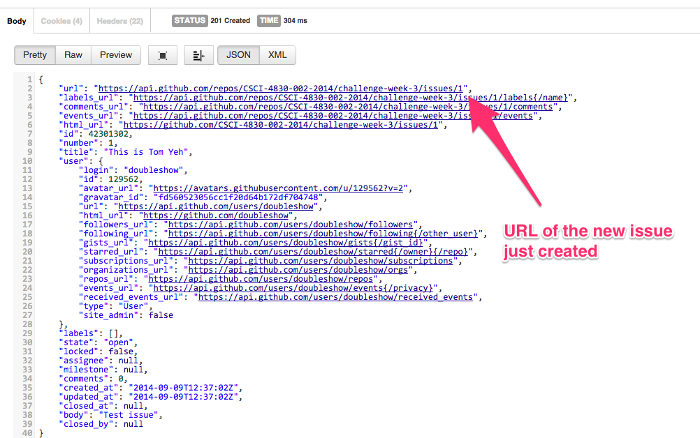

Total: 90 points.

(This is a part of [week 3's learning challenge](/challenges/3/))

Your challenge is to learn about using RESTful APIs to interact with web services to work with data.

# Twitter API via Postman

Watch this [video tutorial](https://www.youtube.com/watch?v=fhPb6ocUz_k) on Youtube to learn how to use a GUI tool (i.e., Postman for Chrome) to interact with the Twitter API.

## Checkpoint 1

The tutorial first demonstrates how to grab an account's timeline data. Chose a celebrity user's account. Apply this skill to grabbing this account's timeline data. Show the JSON data returne by the server in Postman's GUI. It should look like below, but the content should be about the celebrity account you chose. Take a screenshot of your entire desktop to submit.

## Checkpoint 2

Next, the tutorial demonstrates how to post a status update from your own account. Apply this skill to post the message _"Twitting from Postman by [your name]!"_ Show the JSON data returned by the server in Postman's GUI. It should look like below, but the _text_attribute should be replaced by your own text. Take a screenshot of your entire desktop to submit.

# Node.js - Beginner's Guide

Read the article [An Absolute Beginner's Guide to Node.js](http://blog.modulus.io/absolute-beginners-guide-to-nodejs).

## Checkpoint

After you've completed the "Doing Something Useful - File I/O" section and succcessfully run _my_parser.js_ from the command line, try the code on a longer log file (use the gist is below). Take a screenshot of your entire desktop to submit.



## Checkpoint

Next, you will learn how to create a simple web server to respond with the message "Hello World" at [http://localhost:8080](http://localhost:8080). Make the server say the message "Hello [Your Name]" instead (e.g., Hello John Smith). Try to use Postman to send a request to the server and see if you can see the result like below. Take a screenshot of your entire desktop to submit.

# Node.js - Express

Read the article [Introduction to Express](http://code.tutsplus.com/tutorials/introduction-to-express--net-33367). You can clone the example code from this [github repository](https://github.com/tutsplus/intro-to-express).

## Checkpoint

In the first example (i.e., blog1), everything is static. Demonstrate your understanding by modifying the content on the "About Me" page to display your name instead, like below. Take a screenshot of your entire desktop to submit.

## Checkpoint

In the second example (i.e., blog2), you learn about using connecting routes (e.g., /about) to views (e.g., views/about.html). Demonstrate your understanding by adding a new "Contact" page that looks like below. The link should be [http://localhost:3000/contact](http://localhost:3000/contact). Take a screenshot of your entire desktop to submit.

## Checkpoint

In the third example (i.e., blog3), you learn about using the template engine to display dynamic content defined in a data structure. Demonstrate your understanding by (1) modifying the title of the first blog article to include your name, and (2) adding a new article titled "Big Data/HCI Learning Challenge" with a new date, like below. Take a screenshot of your entire desktop to submit.

# Checkpoint 

Skip the fourth example (i.e., blog4). See if you can use Postman to retrieve the content of the new page you created at the previous checkpoint. It should look like below. Take a screenshot of your entire desktop to submit.

# Splunk RESTful APIs via Postman

You can use APIs to access the Splunk server running on your computer. The default port is 8089. Your challenge is to figure out how to send a search query and get results. The API endpoint you want to use is:  

# Challenge

[List all public repositories](https://developer.github.com/v3/repos/#list-all-public-repositories)

# Challenge

[List organization repositories](https://developer.github.com/v3/repos/#list-organization-repositories)

# Challenge

[List forks](https://developer.github.com/v3/repos/forks/#list-forks)

# Challenge

[List pull requests](https://developer.github.com/v3/pulls/#list-pull-requests)

# Challenge

[Get contributors list with additions, deletions, and commit counts](https://developer.github.com/v3/repos/statistics/#contributors)

# Challenge

Create an issue for the [challenge-week-3 repository](https://github.com/CSCI-4830-002-2014/challenge-week-3/issues).

(Reference: [Create an issue](https://developer.github.com/v3/issues/#create-an-issue))

The desired outcome is that you've created an issue via Github's API for the challenge-week-3 repository. The title of the issue should be changed to include your own name. You should see something like below (but don't submit a screenshot of this).

This API requires authentication (unlike in the previous challenges). The hints are: (1) use the Basic Auth tab, (2) use POST request, and (3) according to Github's API documentation about [parameters](https://developer.github.com/v3/#parameters), for POST requests, parameters should be encoded as JSON. You will need to enter this JSON snippet somewhere via Postman's interface. 


{
	"title": "This is [Name]",
	"body" : "I ate [food-name] for breakfast today."
}


