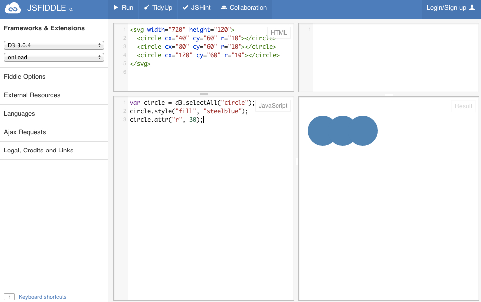

This is an introductory learning challenge based on D3. Your challenge is to learn as much about D3 as you can from this tutorial article "[Three Little Cricles](http://bost.ocks.org/mike/circles/)" written by Mike Bostock.

In the article, you will encounter a bunch of HTML5 code and JavaScript code. Use [JSFiddle](http://jsfiddle.net/) to try the code out. Once you visit JSFiddle, you will see places for you to copy and paste code snippets. You can hit run to see the results, like below.

Hint: Make sure you select the right library from the dropdown boxes under Frameworks & Extensions.

# Challenges

One way to show you have indeed learned a new skill is to apply that skill to a novel problem. You can make three or four blue circles just as what the tutorial article has demonstrated. That's great! But we want to challenge you to do something new.

### Challenge 1 - Draw 10 circles.

### Challenge 2 - Make the four circles red. Reverse the horizontal order so that the leftmost circle is the biggest.

# Study Questions

Next, we want to give you a few study questions to help you learn more.

1. What does D3 stand for?
2. What is the big deal about D3?
3. Who is Mike Bostock?
4. In the expression _function(d) { return Math.sqrt(d); }_, can _d_ be replaced by another variable name such as _t_? Why or why not?
5. Which sentence or paragraph in the tutorial article is impossible to understand and can be skipped for now? 

Write down your answers to TWO of these study questions. Think about the others and be ready to discuss them in class.

