Your challenge is to learn about D3 by reading the two basic tutorial articles below:

* [D3 - Let’s Make a Bar Chart](http://bost.ocks.org/mike/bar/)
* [D3 - Let’s Make a Bar Chart, II](http://bost.ocks.org/mike/bar/2/)

# Checkpoints

## Checkpoint 1

This checkpoint is when you've reached the end of the article [Let’s Make a Bar Chart](http://bost.ocks.org/mike/bar/). Take a screenshot of your entire desktop like below to submit.

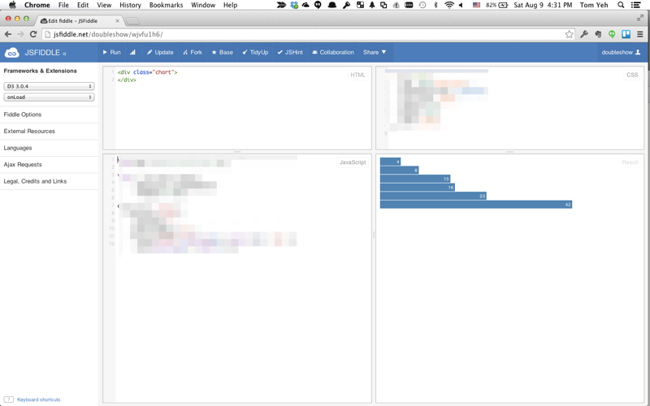

## Checkpoint 2

This checkpoint is when you've reached the end of the article [Let’s Make a Bar Chart, II](http://bost.ocks.org/mike/bar/2/). Again, take a screenshot of your entire desktop to submit. 

One potential stumbling block is loading data. In the example code,


d3.tsv("data.tsv", function(error, data) {


the path to the data file _data.tsv_ must be replaced by an URL pointing to an actual file hosted somewhere by some server. You may already know how to host a data file on your own. But if you don't have a hosting solution working for you, consider the solution described next.

### Creating a data Gist

Let's learn a neat trick of using Gist to host your data online for free. Copy and paste the text below to create a Gist.

<pre>
name	value
Locke	4
Reyes	8
Ford	15
Jarrah	16
Shephard	23
Kwon	42
</pre> 

You want to be able to see something like this.  

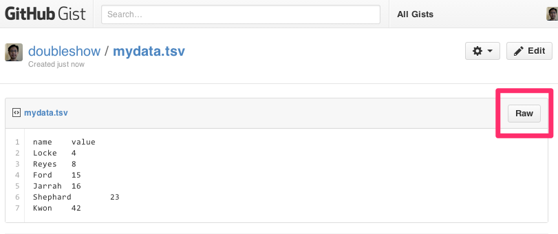

Press the "Raw" button to get the URL linking directly to this data file. 

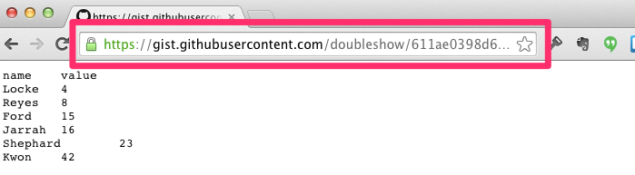

You can then use this URL in your D3 code to get the desired result.

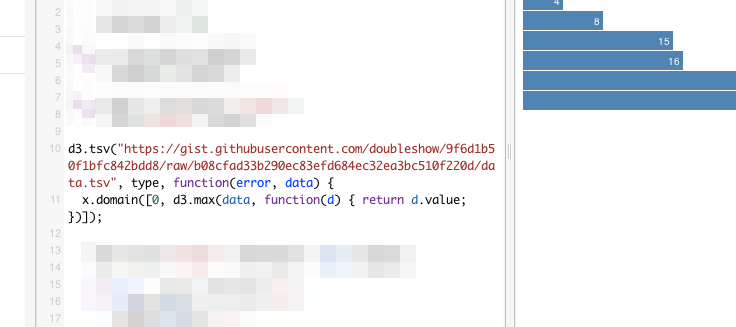

# Study Questions

Q1. What would happen if the data's heading reads differently, like below? Where in the code do you need to modify to get it to work again?

<pre>
firstname	count
Locke	4
Reyes	8
Ford	15
Jarrah	16
Shephard	23
Kwon	42</pre>

Q2. What is the point of going through so much trouble to use D3 to make a barchart?  Why don't we just use Excel? What are the benefits of using D3?

Q3. In the code below, what is the purpose of the second argument __type__?

 
 d3.tsv("data.tsv", type, function (error, data) ...
 

# Challenges

###__Challenge 1:__ Load a new dataset - 10 points

This dataset is US's population and income distributions across age groups. 
The content of this dataset is stored as a Gist.
<!-- <pre>
group	population	income
Under 05	21434	8
05 to 09	20785	9
10 to 14	19893	10
15 to 19	21086	13
20 to 24	21154	16
25 to 29	21453	27
30 to 34	19632	32
35 to 39	19888	35
40 to 44	20559	36
45 to 49	22527	34
50 to 54	21860	35
55 to 59	19172	32
60 to 64	16223	30
65 to 69	12020	25
70 to 74	8936	20
75 to 79	7181	18
80 to 84	5783	17
85 and over	4693	16
</pre>
 -->
<!-- A data gist is made available for you: [Data Gist](https://gist.githubusercontent.com/doubleshow/21e3f7f9afc1383b41b3/raw/bb79556432487f3b143f5b57662d839aeb564c6f/popdist). Copy the URL and use it in your D3 code. -->



Click on the "view raw" button to get the URL you can use in your D3 code. The desired output is shown below. 

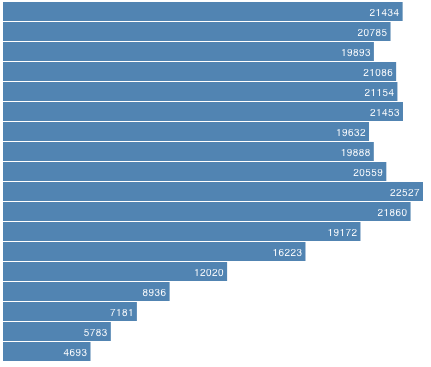

Hint: You will need to modify every instance of _d.value_ to something else.

Save your JSFiddle work. Record the URL. Enter the URL in your submission template.

###__Challenge 2:__ Create variations - 40 points

#### a. Make each bar thinner. (5 points)

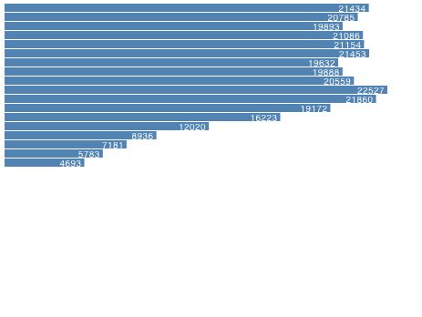

Save your JSFiddle work. Record the URL. Enter the URL in your submission template.

#### b. Make each bar thinner, but more spaced out. (5 points)

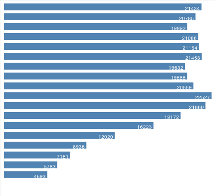 

Save your JSFiddle work. Record the URL. Enter the URL in your submission template.

#### c. Right align the text. (5 points)

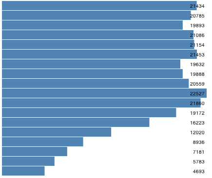

Save your JSFiddle work. Record the URL. Enter the URL in your submission template.

#### d. Right align the bars. (5 points)

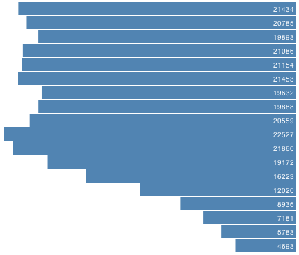 

Save your JSFiddle work. Record the URL. Enter the URL in your submission template.

#### e. Set the background to light blue. (5 points)

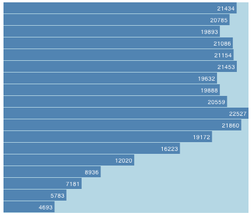

Save your JSFiddle work. Record the URL. Enter the URL in your submission template.

#### f. Display the value in the "income" column together with population. (5 points)	

Save your JSFiddle work. Record the URL. Enter the URL in your submission template.

#### g. Visualize the income column by opacity. Lower income is represented by lighter blue. (10 points)

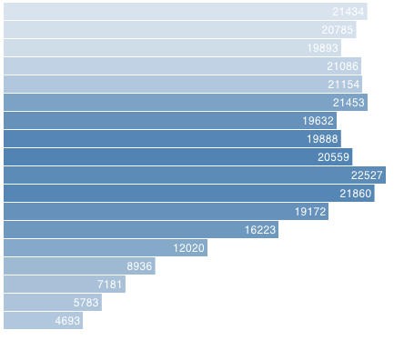

Save your JSFiddle work. Record the URL. Enter the URL in your submission template.

Hints: 

* You will need to add this line somewhere.


.attr("opacity", function(d) { return z(d.income); })


* You need to define a new scaling function _z_.

* You need to modify this to coerce _income_ to a number too.


function type(d) {
  d.population = +d.population; // coerce to number
  return d;
}


