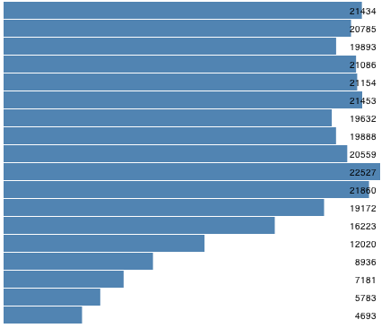
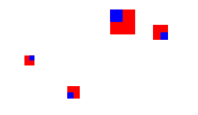

# Checkpoints

## Checkpoint 1

Recall the previous [D3 learning challenge](/units/d3_2) in which you created a variety of bar charts using JSFiddle. Redo challenges 2-a, 2-c, and 2-e. 

| 2-a | 2-c | 2-e |
|  |  |  |

Instead of using JSFiddle, put everything in a single HTML document (i.e., one HTML document per challenge).

If it is necessary to refresh your memory how to make bar charts, you can work through a very detailed exercise about it in 
[Chapter 6. Drawing with Data](http://chimera.labs.oreilly.com/books/1230000000345/ch06.html) of the book 
[Interactive Data Visualization for the Web](http://chimera.labs.oreilly.com/books/1230000000345).

Submit the three HTML documents you've created. Open each document in a web browser and take a screenshot to submit.

## Checkpoint 2

Read the section [Making a scatterplot](http://chimera.labs.oreilly.com/books/1230000000345/ch06.html#_making_a_scatterplot) in [Chapter 6. Drawing with Data](http://chimera.labs.oreilly.com/books/1230000000345/ch06.html). Create a scatterplot as demonstrated in the chapter in an HTML document. Add your name to the document, like below.

Submit the HTML document and a screenshot.

## Checkpoint 3

Read the next chapter [Chapter 7. Scales](http://chimera.labs.oreilly.com/books/1230000000345/ch07.html). In the end, you will make a large, scaled scatterplot (Figure 7-8). Submit a screenshot and the HTML code you've written.

## Checkpoint 4

Read [this article](https://www.dashingd3js.com/svg-basic-shapes-and-d3js) to learn how to draw straight lines. 

Here is a skeleton program for drawing several straight lines.



The result of this program is shown below.

To demonstrate you have learned how to draw straight lines, modify this program such that the lines go vertically and the length of each line reflects the value in the data array, like below. 

Submit the HTML document and a screenshot.

# Challenges

## Challenge 1 - Github + D3

Here is a skeleton D3 program to display information about our course's repositories. 



It uses D3's built-in [json method](https://github.com/mbostock/d3/wiki/Requests#d3_json) to read the data into the JSON format and displays the data as rows of text. Your challenge is to enhance this program to create visualizations to answer the following questions:

The API endpoint is: [https://api.github.com/orgs/csci-4830-002-2014/repos](https://api.github.com/orgs/csci-4830-002-2014/repos)

(Disclaimer: These questions are not necessarily all that meaningful. They are more for the purpose of practicing D3.)

### 1-a. How many forks do these repositories have?

Create a bar chart. Submit your code and a screenshot.

### 1-b. What is the relationship between the number of forks and the size of each repository?

Create a scatter plot. Each dot is a repository. Label each dot using the name of the repository. Submit your code and a screenshot.

### 1-c. Given the relationship above, what is the role of the number of open issues? 

On the same scatter plot, represent the measure "number of open issues" for each symbol using either color or size.

### 1-d. What is the detailed information of each repository?

On the same scatter plot, add a tooltip to each dot. The tooltip should display other attributes about a repository. Look at the raw JSON data returned by Github to get a sense what other attributes are returned. Choose some interesting attributes to include in the tooltip.

Use the [d3-tip library](https://github.com/Caged/d3-tip). Here is a good [example](http://bl.ocks.org/Caged/6476579). Make sure you include the d3-tip library by adding this line

	

Submit your code and a screenshot (taken when the tooltip is visible).

## Challenge 2 - Custom Visualizations

Why D3 when we can accomplish so much with Tableau and so quickly? It is true that if all you need are conventional visualizations like bar charts or line graphs, Tableau is hard to beat. But if you ever want to make custom, one-of-a-kind, creative, or even crazy visualizations, D3 is a very attractive tool to use.

Consider this toy dataset expressed in JSON:

    var dataset = [
      { 'quadrant': 1,
        'size': 20,
        'x': 20,
        'y': 45,
        'energy': 15,
        'angle': Math.PI/4,
        'distance': 20
      },
      { 'quadrant': 2,
        'size': 50,
        'x': 30,
        'y': 15,
        'energy': 5,
        'angle': Math.PI/3,
        'distance': 40
      },
      { 'quadrant': 3,
        'size': 25,
        'x': 25,
        'y': 65,
        'energy': 10, 
        'angle': -Math.PI/3,
        'distance': 30
      },
      { 'quadrant': 4,
        'size': 30,
        'x': 35,
        'y': 25,
        'energy': 20,                                          
        'angle': -Math.PI/4,
        'distance': 40
      },              
    ];  

We want to visualize the dataset like this:

The various attributes of each data point are represented as follows:

1. _size_ is represented by the dimension of each red box.
2. _x_ and _y_ are represented by the x and y locations of the red box.
3. _quarant_ is represented by a blue circle inside the red box in the corresponding quadrant.
4. _energy_ is represented by the length of a black bar sticking from below the red box. 
5. _angle_ and _distance_ is represented by a light blue circle positioned with respect to the blue circle, connected by a thin black line.

You will start with a skeleton program. 



This skeleton program gives you the following visualization

Note that each symbol is under a 'g' parent node. Elements within each 'g' node has a local coordinate system, in which (0,0) corresponds to the upper-left corner of each red square.

Your challenge now is to take a series of steps to build up this custom visualization.

### 2.a. Size each rectangle

Hint: You need to modify 

	.attr("width", 20)
	.attr("height", 20)

### 2.b. Represent quadrant using an inner square

Hint: Add and modify these lines

	symbol.append("rect")
	    .attr("width", function(d,i){
	        return 0; // TODO
	    })
	    .attr("height", function(d,i){
	        return 0; // TODO
	    })                
	    .attr("x", function(d){
	      if (d.quadrant == 1 || d.quadrant == 4){
	          return 0; // TODO
	      }else{
	          return 0; // TODO
	      }
	    })
	    .attr("y", function(d){
	      if (d.quadrant == 3 || d.quadrant == 4){
	          return 0; // TODO
	      }else{
	          return 0; // TODO
	      }
	    })                
	  .attr("fill", "blue");       

Remember, x and y are with respect to a local coordinate system whose origin is the upper-left corner of each red square.

### 2.c. Represent quadrant using a circle

Hint: Replace the code in 2.b with these lines 

    symbol.append("circle") 
        .attr("r", function(d){
          return d.size/4;
        })            
        .attr("cx", function(d){
          if (d.quadrant == 1 || d.quadrant == 4){
              return 0; // TODO
          }else{
              return 0; // TODO
          }
        })
        .attr("cy", function(d){
          if (d.quadrant == 3 || d.quadrant == 4){
              return 0; // TODO
          }else{
              return 0; // TODO
          }
        })                
      .attr("fill", "blue");    

### 2.d. Represent energy using a bar

Hint: Add and modify these lines

    symbol.append("rect")
        .attr("width", function(d,i){
            return 10;
        })
        .attr("height", function(d,i){
            return 0; // TODO
        })                
        .attr("x", function(d){
            return 0; // TODO
        })
        .attr("y", function(d){
            return 0; // TODO
        })                
      .attr("fill", "black");   

### 2.e. Represent angle and distance using another circle

Hint: Add and modify these lines

	symbol.append("circle")
	    .attr("r", function(d){
	      return 5;
	    })            
	    .attr("cx", function(d){
	        return 0; // TODO
	    })
	    .attr("cy", function(d){
	        return 0; // TODO
	    })                
	    .attr("fill", "skyblue"); 

You will need to use _Math.cos()_ and _Math.sin()_ to calculate the location of the light blue circle given _d.angle_ and _d.distance_, and an offset, which is the center of the "quadrant" circle.

### 2.f. Connect two circles with a straight line

Hint: Add and modify these lines

	symbol.append("line")
		.attr("x1", function (d){
		    return 0; // TODO
		})
		.attr("y1", function (d){
		    return 0; // TODO
		})
		.attr("x2", function (d,i){
		   return 0; // TODO
		})
		.attr("y2", function (d,i){
		    return 0; // TODO
		})               
		.attr("stroke-width", 2)
		.attr("stroke", "black");

## Challenge 3 - Implement Hand-drawn Visualizations

In this challenge, you are given a series of hand drawn sketches to illustrate unconventional ideas for visualizing the data about our course's repositories. Your task is to implement them in D3. These are to simulate a scenario in which you work with a client to design and develop a custom data visualization. Your client has an idea and draws a sketch to show it to you. And your job is to turn the sketch into a D3 program.

### 3.a. "Letter" Plot

### 3.b. "Pin" Chart

### 3.c. "Box" timeline

- The visualization has two columns of boxes.
- Each month is represented as a box in the first column.
- Each repo is represented as a box in the second column.
- Each repo is connected to the month the repo was created by a straight line.

