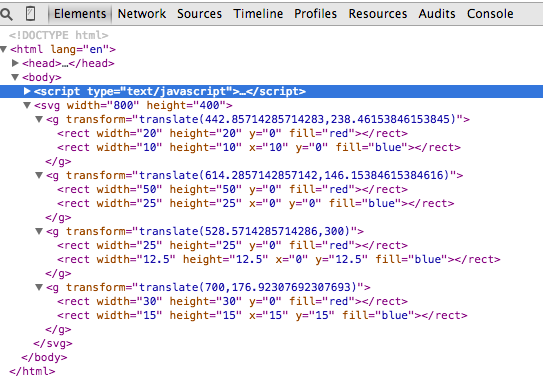
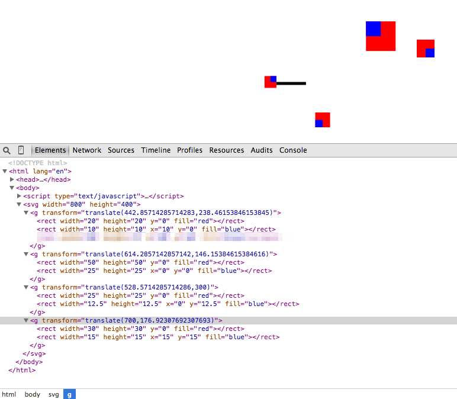

# Checkpoints

Read and study [Chapter 9. Updates, Transitions, and Motion](http://chimera.labs.oreilly.com/books/1230000000345/ch09.html). This is a long chapter. Start early.

## Checkpoint 1

After you are able to recpliate 9-6, take a screenshot and submit. It must be the result from your own code. Submit your D3 code too.

## Checkpoint 2

After you are able to recpliate 9-7, take a screenshot and submit. It must be the result from your own code. Submit your D3 code too.

## Checkpoint 3

After you are able to recpliate 9-12, take a screenshot and submit. It must be the result from your own code. Submit your D3 code too.

## Checkpoint 4

After you are able to recpliate 9-16, take a screenshot and submit. It must be the result from your own code. Submit your D3 code too.

## Checkpoint 5

After you are able to recpliate 9-21, take a screenshot and submit. It must be the result from your own code. Submit your D3 code too.

## Checkpoint 6

After you are able to do the first exercise right below 9-21 (i.e., Add code in the below-left panel to add labels to the newly created bars. Test your solution in the output panel at right), take a screenshot and submit. It must be the result from your own code. Submit your D3 code too.

## Checkpoint 7 

After you are able to do the second exercise right below 9-26 (i.e., Add code in the below-left panel to remove the labels corresponding to the deleted bars. Test your solution in the output panel at right), take a screenshot and submit. It must be the result from your own code. Submit your D3 code too.

## Checkpoint 8

After you are able to do the third exercise right below 9-31 (i.e., Add code in the below-left panel to remove the labels corresponding to the deleted bars. Test your solution in the output panel at right), take a screenshot and submit. It must be the result from your own code. Submit your D3 code too.

# Challenges

## Challenge 1

Review the learning challenge 2 from the previous week. Pay specific attention to the use of the grouping node (g). Open your solution for 2.b in Chrome. You should see 

Learn how to use Chrome's web developers' tool to inspect elements. Figure out how to open the "Elements" view. Explore the DOM structure of the HTML document and try to examine the 'g' nodes, like this:

Pay attention that there are 4 'g' nodes. Each node consists of two children nodes. You can edit directly in the "Elements" view, such as changing the attributes of the rect tags. Your challenge is to figure out how to manually edit the DOM in order to change the visualziation to below. Note that the blue regions in two of the symbols have been extended.

Take a screenshot of both the modified visualization and the "Elements" view showing your modifications, like below.

## Challenge 2

Add a black horizontal bar protuding out from the right side of symbol. Manually edit the "Elements" view to achieve this. Submit a screenshot like below. Figure out what is in the line that is blurred out.

## Challenge 3

Now, turn your attention to the D3 code. Add code to your solution to 2.b to implement this new visual feature to represent the _energy_ attribute of each data point. Submit a screenshot like below to show that you got it.

