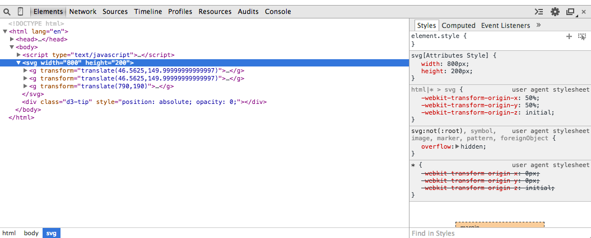

# Checkpoints

Read and study [Chapter 9. Updates, Transitions, and Motion](http://chimera.labs.oreilly.com/books/1230000000345/ch09.html).

## Checkpoint 1

After you are able to recpliate 9-21, take a screenshot and submit. It must be the result from your own code. Submit your D3 code too.

## Checkpoint 2

After you are able to do the first exercise right below 9-21 (i.e., Add code in the below-left panel to add labels to the newly created bars. Test your solution in the output panel at right), take a screenshot and submit. It must be the result from your own code. Submit your D3 code too.

## Checkpoint 3 

After you are able to do the second exercise right below 9-26 (i.e., Add code in the below-left panel to remove the labels corresponding to the deleted bars. Test your solution in the output panel at right), take a screenshot and submit. It must be the result from your own code. Submit your D3 code too.

## Checkpoint 4

After you are able to do the third exercise right below 9-31 (i.e., Add code in the below-left panel to remove the labels corresponding to the deleted bars. Test your solution in the output panel at right), take a screenshot and submit. It must be the result from your own code. Submit your D3 code too.

# Challenges

## Challenge 1

Complete the [Yelp hackathon](/hackathons/yelp/) on your own. Check out (or fork) the [repository](https://github.com/CSCI-4830-002-2014/hackathon-yelp) of this hackathon, which contains the starter code. Get the stater code to run. You should be able to see the D3 visualization and examine the three _g_ elements, like below:

When you are able to see this, take a screenshot and submit to demonstrate you've got the starter code working on your machine.

## Challenge 2

Modify _app.js_ to pass the data to D3 to show ALL businesses in Middleton, like below:

## Challenge 3

Modify _app.js_ to pass the data about ALL businesses in Las Vegas instead.

## Challenge 4

Come up with another interesting query about the _business_ collection. Modify the D3 code in _views/business.html_ to customize the visualization to do something interesting per your creativity.
