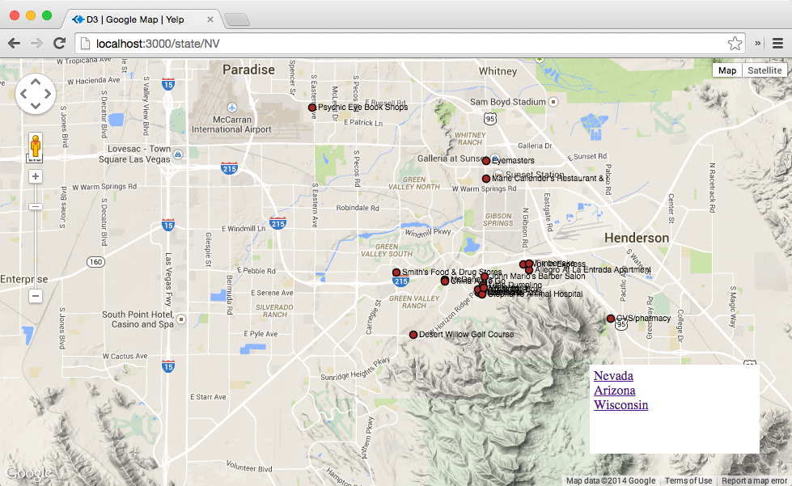
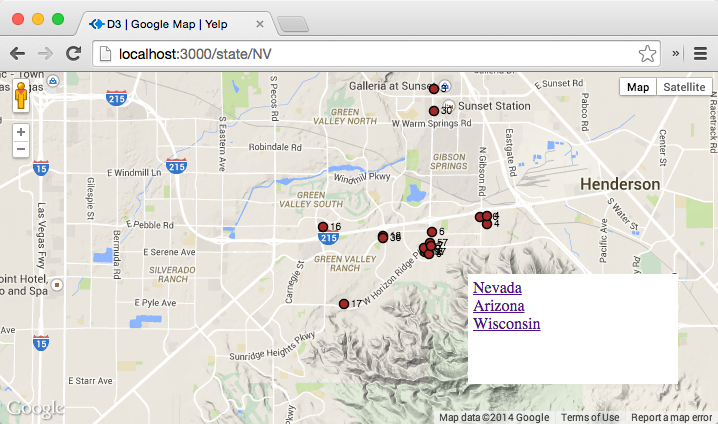
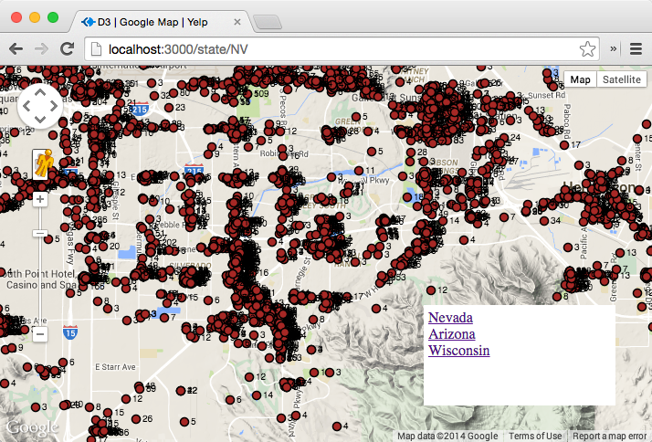
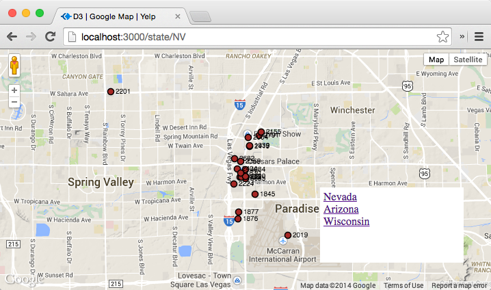
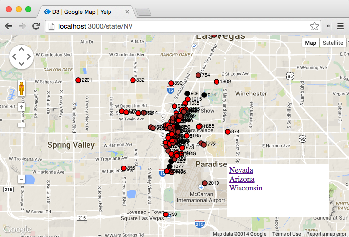
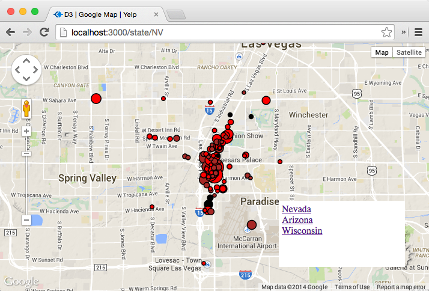
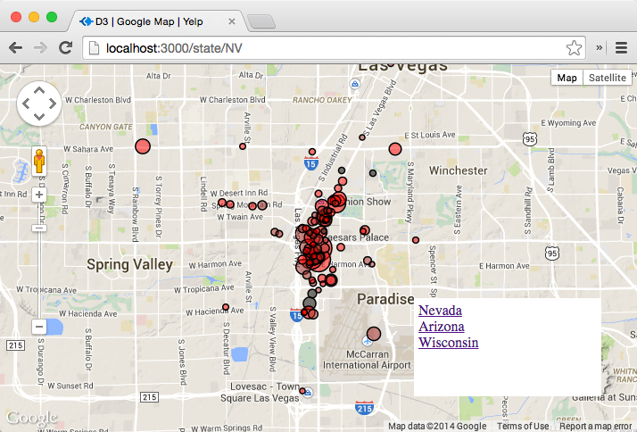

# Checkpoint

The objective of this learning unit is to acquire the basic skills to create D3 visualizations on top of a Google Map.

## Checkpoint 1

Checkout the Github repo of this week's challenge. You will find the starter code for this learning unit. This code creates a D3 + Google Map visualization of the businesses in the Yelp dataset. This code is essentially an Node Express server that retrieves data from a Mongodb datbase and then serves D3 visualizations of the data. It is similar the one you worked on in the previous week. 

Get the starter code running on your computer. You will need to modify _app.js_ by filling in the parameters for connecting to a MognoDB database. Assuming the server is running on the localhost. Open the URL [http://localhost:3000/state/NV](http://localhost:3000/state/NV) and you should see a map with lots of visual markers, like below:

Once you got the code running on your computer, take a screenshot and submit. Note that for this D3 unit, you only need to submit screenshots. We will save you the trouble of uploading code this time.

## Checkpoint 2

This starter code displays the name of each business next to each marker. Figure out how to display the "review count" instead. You need to change _business_map.html_. The The desired visualization should be like below.
 visualization should be like below.

Take a screenshot and submit.

## Checkpoint 3 

Where are all the businesses? The start code only shows 20 businesses. Modify _app.js_ so it shows all businesses in the selected state. The The desired visualization should be like below.
 visualization should be like below.

## Checkpoint 4

What are the top 20 business with the most number of reviews? Modify the MongoDB query in _app.js_ to sort the results and return the top 20 in terms of the review count. The The desired visualization should be like below.
 visualization should be like below.

Take a screenshot and submit.

## Checkpoint 5

How do the most frequently reviewed businesses differ in their star ratings? Distinguish them by colors. Use 'red' to fill the markers of those with stars 4 and above. Use 'brown' for those with stars 3 and above, and 'black' for the rest. The The desired visualization should be like below.
 visualization should be like below.

## Checkpoint 6

The review counts are currently displayed as text. They are very hard to see. How about let's use "size" of a marker to indicate the review count of the business associated with the marker? For example, one business with 4500 reviews is presented by a 15-pixel radius circle. Another business with 2000 reviews is represented by a smaller, 3-pixel radius circle.

* Use D3's scaling feature (i.e., d3.scale.linear())
* Set domain to [lowest review count, highest review count] among the top 100 most frequently reviewed.
* You may want to use d3.min and d3.max to find the lowest review count and the highest review count.
* Set range to [3, 15] (pixels).
* You can use the scaling function to, for example, map 4500 reviews to 14 pixels, and 2000 reviews to 3 pixels...etc.
* Hide the text label

The desired visualization should be like below.

Take a screenshot and submit.

## Checkpoint 7

The makers are occluding each other. It may be a good idea to make them semi-transparent. Figure out how to do it. This [stackoverflow article](http://stackoverflow.com/questions/6042550/svg-fill-color-transparency-alpha) may be useful. The The desired visualization should be like below.
 visualization should be like below. 

Take a screenshot and submit.