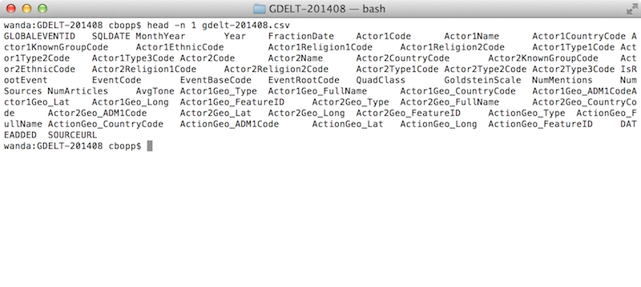
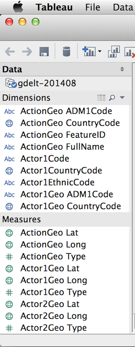
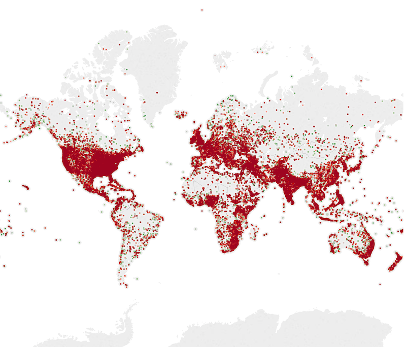
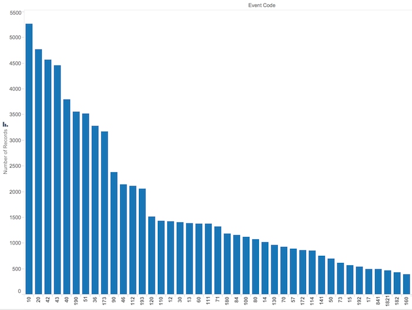

(This is a part of [week 7's learning challenge](/challenges/7/))

You will use Tableau Desktop to explore this data set.

# Checkpoints

As you follow along the tutorial, you will create a series of visulizations and provide answers to questions. Your visualizations may not look exactly the same as what is shown here because the dataset is slightly different.

# Checkpoint 1

Download yesterday’s data set from the [GDELT raw data site](http://data.gdeltproject.org/events/index.html). The file names are in the format YYYYMMDD.export.CSV.zip where YYYY is the four digit year, MM is the two digit month, and DD is the two digit day. Unzip the file and examine the first few lines of the CSV using the head tool.

If you’re running Linux or OS X this tool is already installed and available from your Terminal.app or shell. If you’re on Windows, install [CoreUtils](http://gnuwin32.sourceforge.net/packages/coreutils.htm) for Windows. You’ll need to use the “-n” flag on the head command to specify how many lines you want it to display. Take a screenshot and submit.

# Checkpoint 2

To get an understanding of what is in this data set, familiarize yourself with the GDELT project [here](http://gdeltproject.org/about.html). In order to understand the fields in the data set, review the [GDELT Data Format Codebook](http://data.gdeltproject.org/documentation/GDELT-Data_Format_Codebook.pdf). Some of the fields in the data set use codes that represent actors or event descriptions. These codes are defined under the the CAMEO Actor Code and Event Code sections [here](http://gdeltproject.org/data.html#documentation).

Now that you know a bit more about this project, what types of questions do you think this database could provide insight into?

# Checkpoint 3

Import the data as an extract by choosing the unzipped CSV file and selecting the “Extract” radio button and then clicking the Go to Worksheet button. Take a screenshot of your dimensions and measures and submit.

# Checkpoint 4

Map the action geographic location and color code based on the Goldstein scale. Make a negative number red, and a positive score green. This score shows the theoretical potential impact that type of event will have on the stability of a country. Take a screenshot and submit.

# Checkpoint 5

We shouldn’t assume the map above includes all data points however. Let’s try and figure out how many we’re missing and if there’s some trend we can identify in terms of missing geographic data. Apply a filter that only displays records where latitude is null, and create a bar chart that displays the count of records by event code. Take a screenshot and submit.

Refer to the CAMEO Event Code reference linked above to interpret these events. Do you have any thoughts on why these events are missing geographic information?

# Challenges

### 1. Develop Theory

The UN Climate Summit occurred in New York on September 23rd. Prior to the event, demonstrators [marched](http://peoplesclimate.org/wrap-up/) in New York (and around the world) to [demand action](http://www.nytimes.com/2014/09/22/nyregion/new-york-city-climate-change-march.html). The most difficult challenge you’ll face in using data to impact social issues is proving some kind of intervention had an impact. How might you use data to prove that these marches made a difference at the summit? How might you specifically use the GDELT data?

### 2. Merge Files

Based on your theory from Challenge 1, obtain the relevant data from the [raw data site](http://data.gdeltproject.org/events/index.html). This should be at least 3 or 4 days worth to get a diverse set of data. In this case, Tableau prefers if the data is in a single CSV. write a Node.js script to merge these CSVs into one file and take a screenshot.

### 3. Test Your Theory

Attach a screenshot that represents a test of your theory from Challenge 2. Do you think your theory could prove useful in determining if the marches had an impact?
