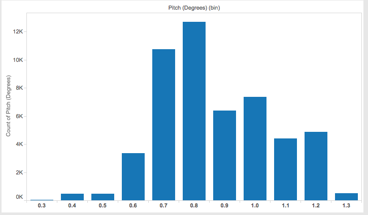
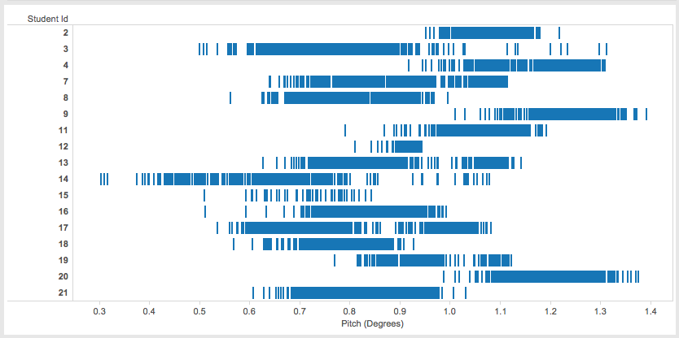
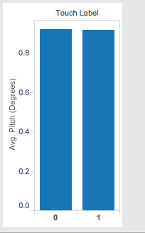
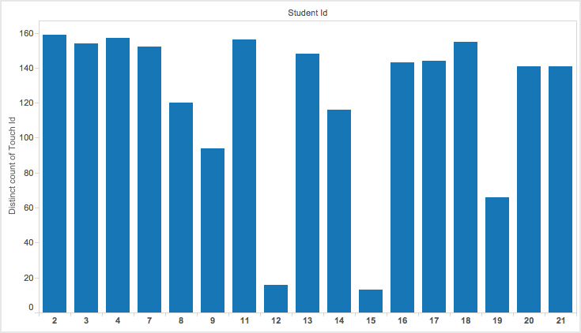

A couple weeks ago, each of you participated in data collection and now the data is ready to analyze.

| [raw_touch_data.xls](raw_touch_data.xls) |

Here are some important columns:

* TIME (ms) - ms since the beginning of the session
* STUDENT ID - unique identifier associated with a student
* TOUCH ID - identifier associted with a touch event (each action event generated multiple sensor readings)
* TOUCH LABEL - 0 means left, 1 means right

All the other columns are from various sensors. 

# Challenge

## Challenge 1

The first challenge is to use Tableau to answer some basic questions. For each question, take a screenshot of the entire Tableau interface and submit.

### 1. What is the distribution of the Pitch (Degrees) values?

### 2. What do the sensor reading patterns differen across individual students in terms of Pitch (Degrees)?

### 3. Is there a significant difference between the two touch types (TOUCH LABEL) in terms of the average Pitch (Degrees)?

### 4. How many unique touch events did students have?

## Challenge 2

The second challenge is open ended. Write your own analysis of this data. Keep the analysis short (300 words max). Include visualizations to support your analysis.

(As a heads up, we will do some simple classifier training on this data next week).