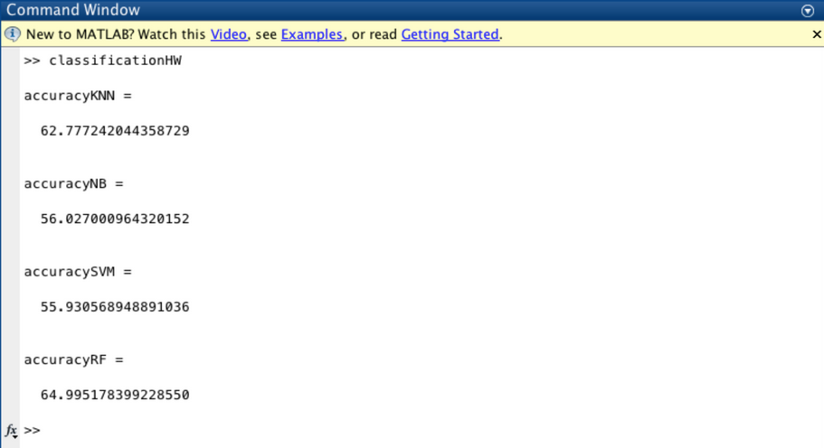

Last week, we analyzed the mobile touch data using Tableau. This week, we will do a simple exercise using machine learnign to analyze the data. The classification task we will consider is "whether a touch event is left or right" using sensor measurements as features.

The dataset you will use is:

| [raw_touch_data.csv](raw_touch_data.csv) |

# Checkpoints

## Checkpoint 1

We have developed a simple Matlab script that will try a variety of classifiers and include a variety of sensor reading features. 



The script above depends on a utility function, below. 



Download these two Matlab files and store them in the same folder. Also, copy the dataset file (i.e., [raw_touch_data.csv](raw_touch_data.csv)) in the same folder.

Get this Matlab script to run on a computer. The expected output in the Matlab GUI Command Line window shoudl be something like below. Take a screenshot and submit.

The four classifiers are: (1) K nearest-neighbor (KNN), (2) Naive Bayes (NB), (3) Support Vector Machine (SVM), and (4) Random Forest (RF). As you can see, the performance with the default parameters are above chance (50%). But we can definitely improve.

## Checkpoint 2

Let's try change some parameters and see what happen to the accuracy performance. Change the parameter for the K-nearest neighbor classifier (i.e., K) from 20 to 10. Add the "light" measurement as a feature by setting the parameter _add_light_ to _true_. Run the script again. Has accuracy improved? Take a screenshot of the new performance numbers. 

# Challenges

Test different combinations of features and training parameters. For each of the four classification algoithms, see if you can find a combination of features and parameter values to achieve really good accuacy performance.

## 1. K-NN 

Report the highest accuracy number you've managed to achieve. Report the features and parameters you used.

## 2. Naive Bayes

Report the highest accuracy number you've managed to achieve. Report the features and parameters you used.

## 3. Support Vector Machine

Report the highest accuracy number you've managed to achieve. Report the features and parameters you used.

## 4. Random Forest

Report the highest accuracy number you've managed to achieve. Report the features and parameters you used.