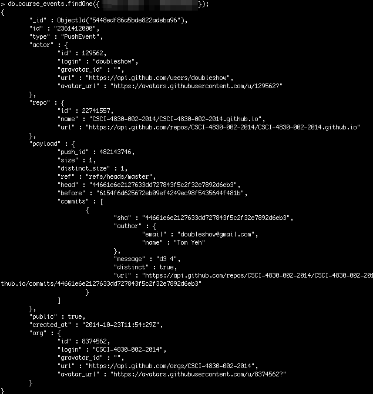
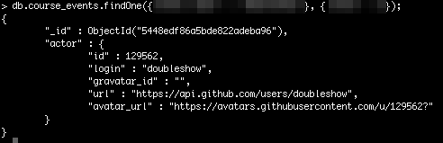
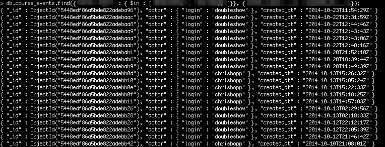
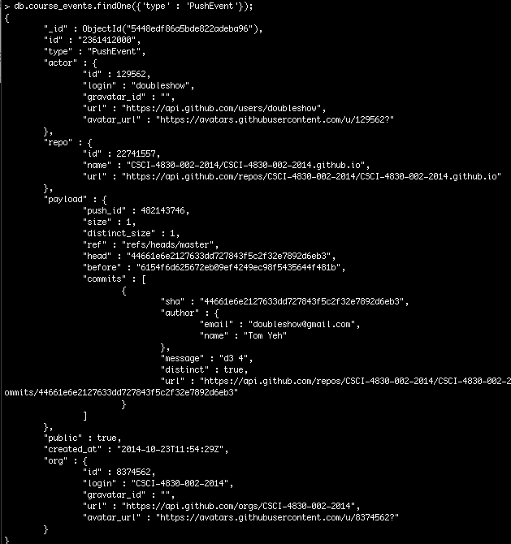
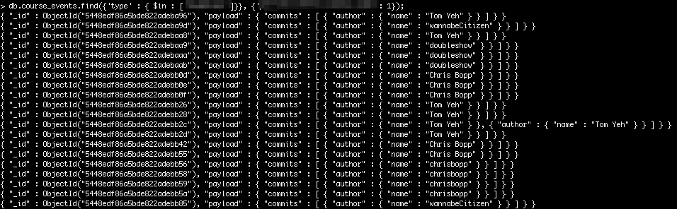
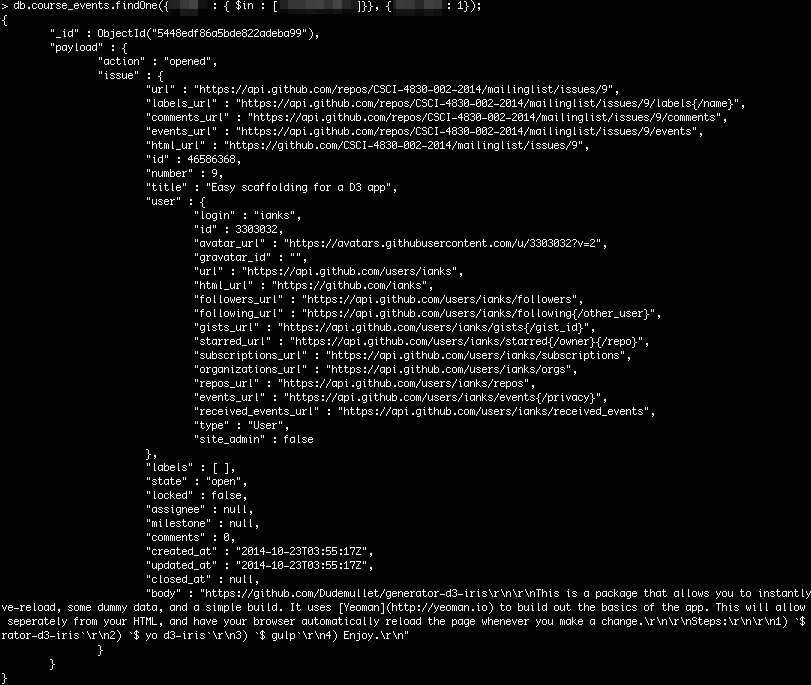
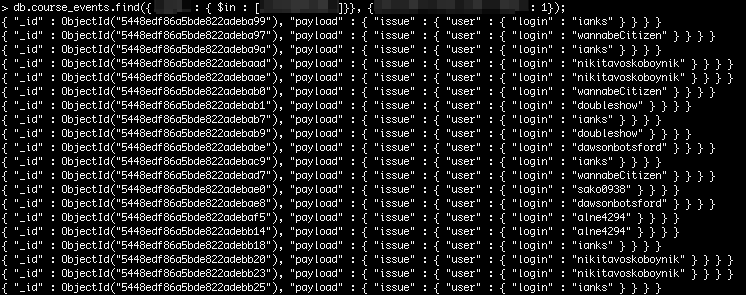
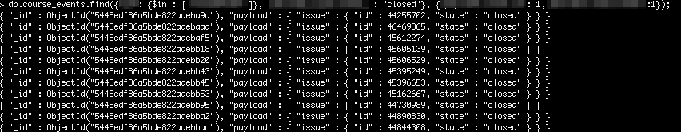
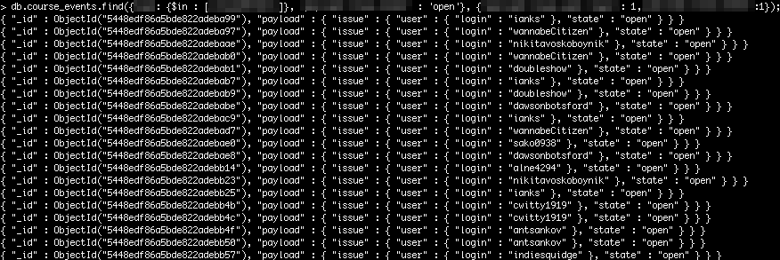
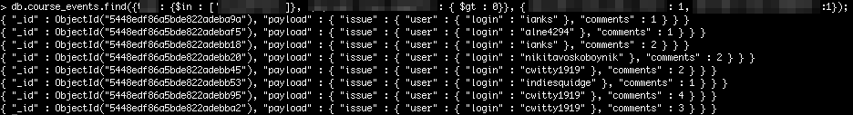

This unit is meant for you to practice making simple queries to a MongoDB server. It will build upon the Course Events data you collected and added to a MongoDB server few weeks ago.

# Checkpoints

# Checkpoint 1: Review

Review what you did for Challenge 3 in the [previous MongoDB unit](/units/mongodb_1/). Get your script to run again. If you script wasn't really not running properly last time, try to fix your script. You are allowed to look at your classmates' successful submissions and learn from them.

Submit your code.

# Checkpoint 2: Count

Suppose you name your collection _course_events_. Open the MongoDB command line interface. After you've successfully run the data collection script. Run this command

	> db.course_events.count();

It should return the count of the events stored in the database. Take a screenshot of your terminal output and submit.

# Challenges

Write MongoDB queries to answer the following questions. For each question, a screenshot is provided to give you an idea what the query and the expected output should look like. Some portions of the query are blanked out. Your challenge is to figure out how to fill in the blanks. Find documentation or tutorials on your own.

## Challenge 1: Find, FindOne, $in, $gt

### 1. What is an example of an event associated with a user (doubleshow)?

### 2. What is an example of an event associated with a user (doubleshow), paying attention only to the _actor_ field?

### 3. When were the events related to these two users (doubleshow, chrisbopp)?

### 4. What does a push event look like?

### 5. Who pushed commits?

### 6. What does the payload of an issues event look like?

### 7. Who created issues?

### 8. What issues had been closed?

### 9. Whose issues are still open?

### 10. Whose issues have been commented?

## Challenge 2: Your own questions

### 1. Your First Question

Pose a question. Write a MongoDB query to answer it.

### 2. Your Second Question

Pose a question. Write a MongoDB query to answer it.

