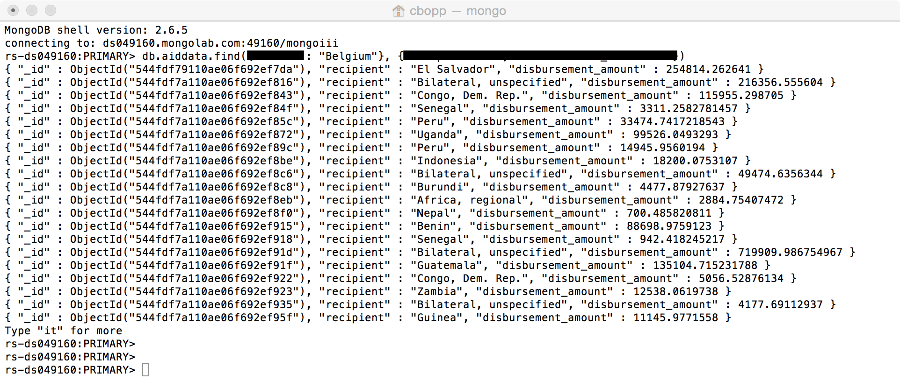
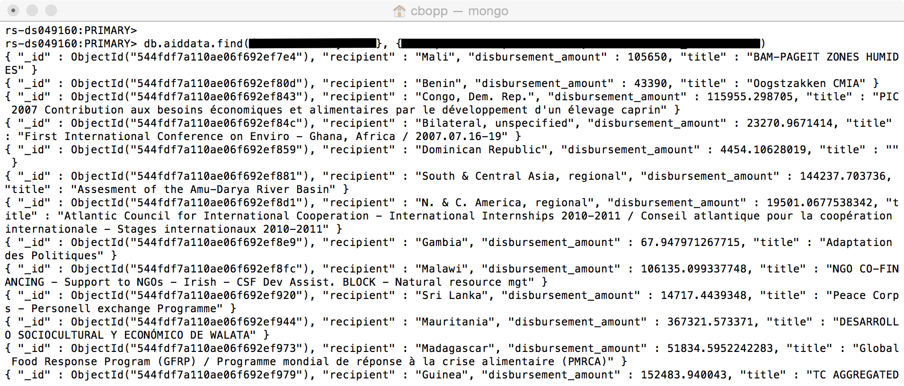
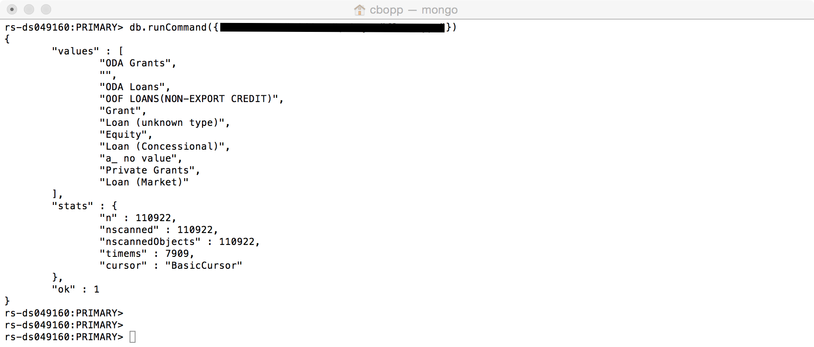
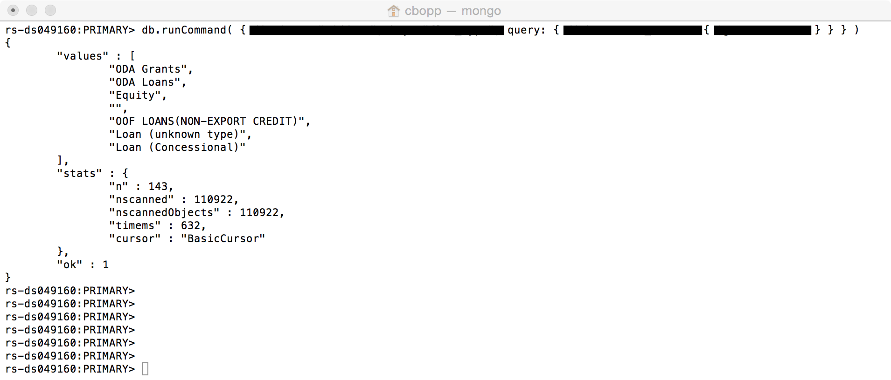
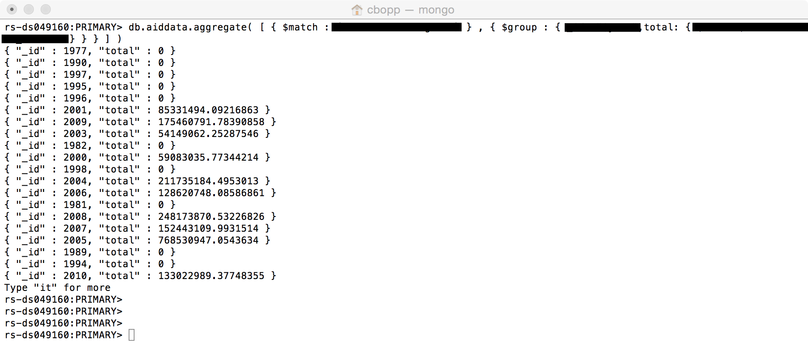

# Checkpoints

# Checkpoint 1

Download this [data set](https://data.itpir.wm.edu/aiddatascratch/aiddata/researchrelease/aiddata2_1_since_1996_csv.zip).

Import this CSV into a local MongoDB instance. Depending on your setup, the import command will be something like this:

	> mongoimport -h localhost:49160 -d mongoiii -c aiddata -u user -p password --file aiddata21research.csv --type csv --headerline

Run this query and take a screenshot:

	> db.collection.count()

# Challenges

Write MongoDB queries to answer the following questions. For each question, a screenshot is provided to give you an idea what the query and the expected output should look like. Some portions of the query are blanked out. Your challenge is to figure out how to fill in the blanks. Take a screenshot to submit when you’ve completed each challenge question.

## Challenge 1

Who did Belgium give money to and how much did they provide?

## Challenge 2

What projects addressed issues of biodiversity?

## Challenge 3

What are the unique values of flow_type?

## Challenge 4

What are the unique values of the flow_type if the disbursement amount is over $100,000,000? 

In the above output, what does “n” mean? How much does it differ between the two queries above?

## Challenge 5

The aggregation pipeline provides an alternative to map-reduce and may be the preferred solution for aggregation tasks where the complexity of map-reduce may be unwarranted. Review this [page](http://docs.mongodb.org/manual/core/aggregation-pipeline/) for more information.

Using aggregation, how much did Belgium give total by year?

