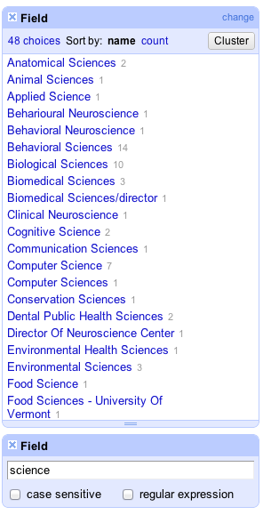

(This is a part of [week 4's learning challenge](/challenges/4/))

# Checkpoints

Read and follow this [OpenRefine Tutorial](http://enipedia.tudelft.nl/wiki/OpenRefine_Tutorial).

## Checkpoint 1

After you've completed the [Clean up country names](http://enipedia.tudelft.nl/wiki/OpenRefine_Tutorial#Clean_up_country_names) section. Take a screenshot and submit.

## Checkpoint 2

After you've completed the [Clean up values for the number of students](http://enipedia.tudelft.nl/wiki/OpenRefine_Tutorial#Clean_up_values_for_the_number_of_students) section. Take a screenshot and submit.

## Checkpoint 3

After you've completed the [Clean up values for the endowment](http://enipedia.tudelft.nl/wiki/OpenRefine_Tutorial#Clean_up_values_for_the_endowment) section. Take a screenshot and submit.

## Checkpoint 4

After you've completed the [Cleaning up dates](http://enipedia.tudelft.nl/wiki/OpenRefine_Tutorial#Cleaning_up_dates). Take a screenshot and submit.

## Checkpoint 5

After you've completed the [Deduplicate entries](http://enipedia.tudelft.nl/wiki/OpenRefine_Tutorial#Deduplicate_entries). Take a screenshot and submit.

# Challenges: Federal Advisory Committee Dataset 

Download the dataeset: [FACAMemberList2004.csv](FACAMemberList2004.csv)

Load the dataset into OpenRefine. Try to accomplish the following sequence of steps and take/submit a screenshot after you've managed to complete each step.

### 1. Move the “Occupation” column to the beginning

### 2. Create a custom Text Facet for selecting professors (or not professors). Hint: use "contains" and "toLowerCase"

### 3. Remove rows that are not professors

### 4. Split the occupation column into two column on the first “,”

### 5. Normalize the text in the occupation field

### 6. Extract the field of study

Hint: use “match” and regular expression /.*Professor Of (.*)/

### 7. Select “Science” (i.e., field names contains the word “Science”)

### 8. Refine the values in the “field” for science

Before refining, the values look like below, containing many close duplicates.

Submit your best refinement result. Should be similar to the screenshot above, but with fewer choices.

