Total: 90 points.

(This is a part of [week 2's learning challenge](/challenges/2/))

Your challenge is to learn the basics about Splunk's query language. Read [Part 5](http://docs.splunk.com/Documentation/Splunk/latest/SearchTutorial/Startsearching) of the Splunk Tutorial.

# Checkpoints (5 points x 4 = 20 points)

## Checkpoint 1 (5 points)

This checkpoint is when you’ve reached the end of the section [Use the search language](http://docs.splunk.com/Documentation/Splunk/latest/SearchTutorial/Usethesearchlanguage). Take a screenshot of your entire desktop to submit.

## Checkpoint 2 (5 points)

This checkpoint is when you’ve reached the end of the section [Use fields to search](http://docs.splunk.com/Documentation/Splunk/latest/SearchTutorial/Usefieldstosearch]). Take a screenshot of your entire desktop to submit.

## Checkpoint 3 (5 points)

This checkpoint is when you’ve reached the end of the section [Use a subsearch](http://docs.splunk.com/Documentation/Splunk/latest/SearchTutorial/Useasubsearch). Take a screenshot of your entire desktop to submit.

## Checkpoint 4 (5 points)

This checkpoint is when you’ve reached the end of the section [Use field lookups](http://docs.splunk.com/Documentation/Splunk/latest/SearchTutorial/Usefieldlookups). Take a screenshot of your entire desktop to submit.

# Study Questions (3 points x 4 = 12 points)

1. In the tutorial data provided by Splunk, what do the host names www1, www2, and www3 mean? Why are there three?

2. What is the purpose of including "status=200" in queries?

3. What is your best guess as the rationale behind the heavy use of the \| (pipe) operator in Splunk queries?

4. Why does one ever need to analyze "product purchase" behaviors from raw server logs retroactively? Why can't we just save every behavior in a structural database?

# Challenges

There are four sets of learning challenges to help you become familiar with three basic commands: [STATS][STATS], [TOP][TOP], [TIMECHART][TIMECHART], and one advanced command: [REX][REX], respectively. The list of challenges may seem long and intimidating. But each challenge is rather small. Some may even take you less than a minute to figure out. You are advised to go through these challenges in sequence. Some of the latter ones may build upon your success in finishing the earlier ones.

As you've completed each challenge, please take a screenshot of your _entire desktop_ and add it to your submission repository. Also, write down the Splunk query you've composed to get the desired results.

[STATS]: http://docs.splunk.com/Documentation/Splunk/6.1.3/SearchReference/Stats
[TOP]: http://docs.splunk.com/Documentation/Splunk/6.1.3/SearchReference/Top
[TIMECHART]: http://docs.splunk.com/Documentation/Splunk/latest/SearchReference/Timechart
[REX]: http://docs.splunk.com/Documentation/Splunk/latest/SearchReference/Rex

## Challenge 1: STATS (2 points x 9 = 18 points)

Use the same dataset you used in the Splunk tutorial above. Answer the following challenge questions using the [STATS][STATS] command. Your queries should take the following form:

	sourcetype=access_* | stats .......

### 1.a. How many events in total?	(2 points)

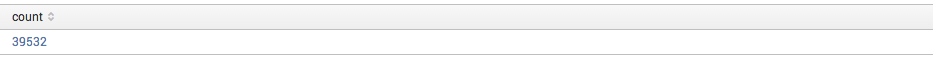

### 1.b. Change the column heading to "Events" (2 points)

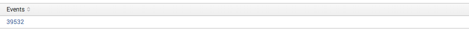

### 1.c. How many purchases? Display in another column. (2 points)

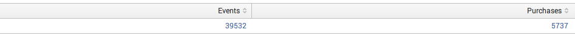

### 1.d. How many actions were purchases, addtocarts, and removes, respectively? (2 points)

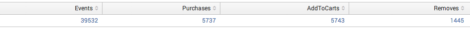

### 1.e. What is the maximum number of bytes transferred? (2 points)

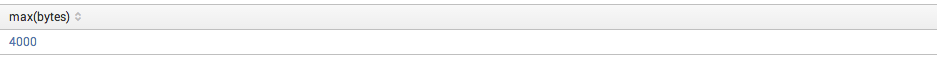

### 1.f. What is the maximum number of bytes transferred? (2 points)

### 1.g. Change the column heading to "MAX" (2 points)
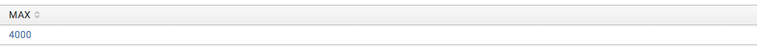

### 1.h. What is the maximum, average, and minimum number of bytes transferred? (2 points)
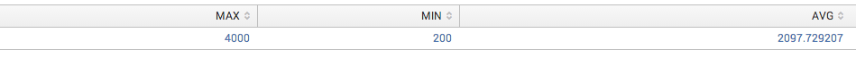

### 1.i. What are the unique productId values? How many of them? (2 points)
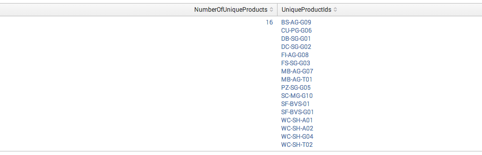

## Challenge 2: TOP (2 points x 7 = 14 points)

This query gives us information about shopping cart actions related to products.

	sourcetype=access_* productId cart.do | 
		table clientip, action, productId, date_month, date_mday, date_wday

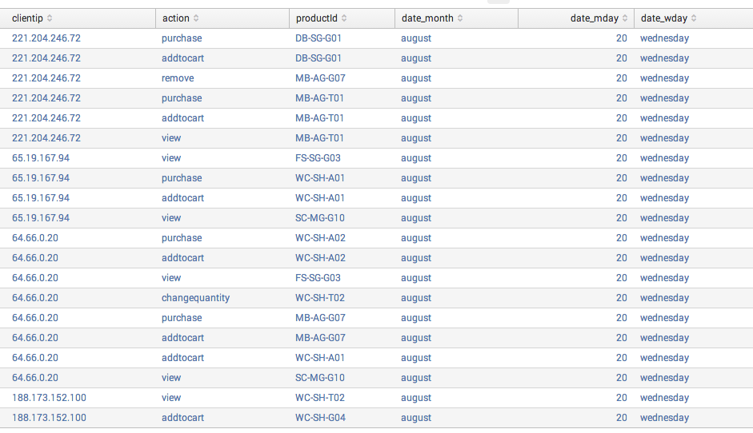

Answer the following challenge questions using the [TOP][TOP] command.

### 2.a. What are the top clientips performing actions on a product? (2 points)

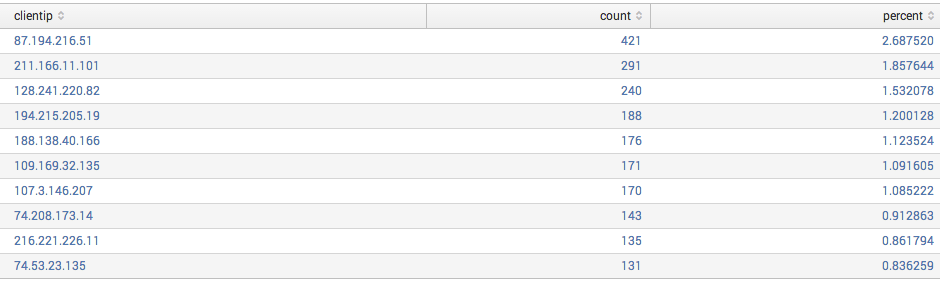

### 2.b. What are the top 3 weekdays with the most number of product-related actions? (2 points)

Note: You need to _limit_ the number of results to 3.

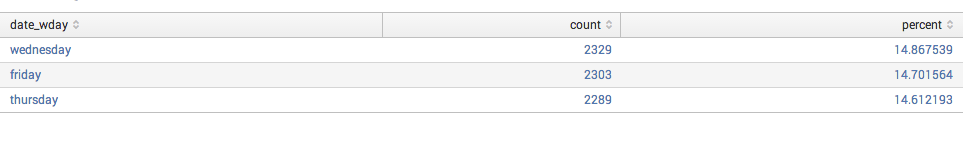

### 2.c. What are the top products in terms of all actions? (2 points)

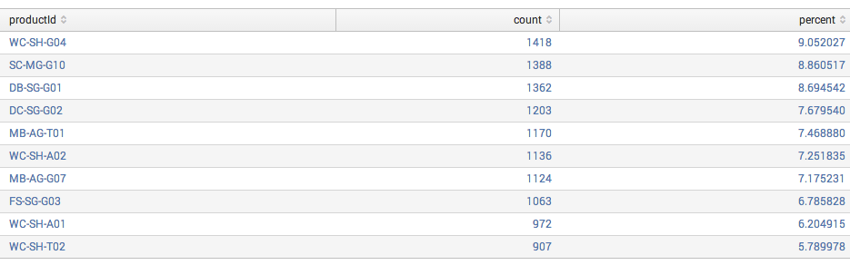

### 2.d. What are the top products that saw actions on Fridays? (2 points)
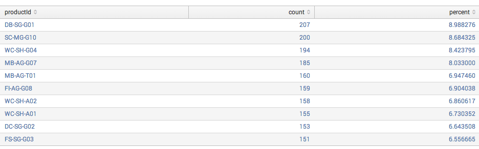

### 2.e. What are the top products that were purchased on Fridays? (2 points)
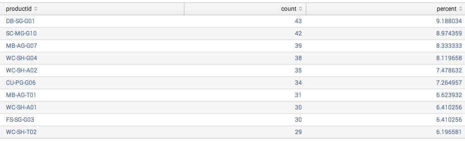

### 2.f. What is the top product that was purchased? (2 points)
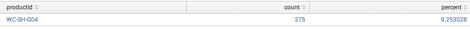

### 2.g. What is the top product that was purchased on each week day? (2 points)
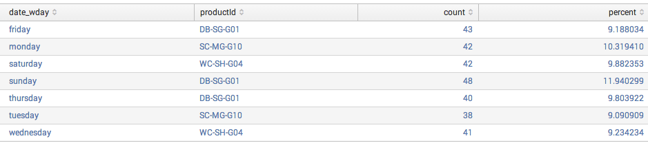

## Challenge 3: TIMECHART (2 points x 9 = 18 points)

	sourcetype=access_* productId=* |
	  table productId, action, clientip, date_month, date_mday, date_wday, date_hour

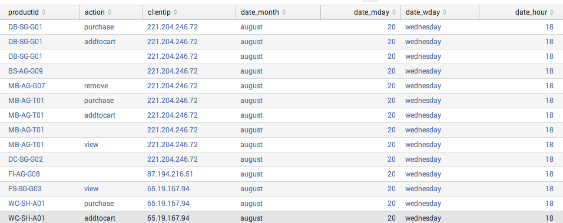

Write queries using the [TIMECHART][TIMECHART] command to answer the challenge questions below. Your queries should take the form of

	sourcetype=access_* productId=* | timechart ...........

### 3.a. How does the total number of product related actions change over time (days)?

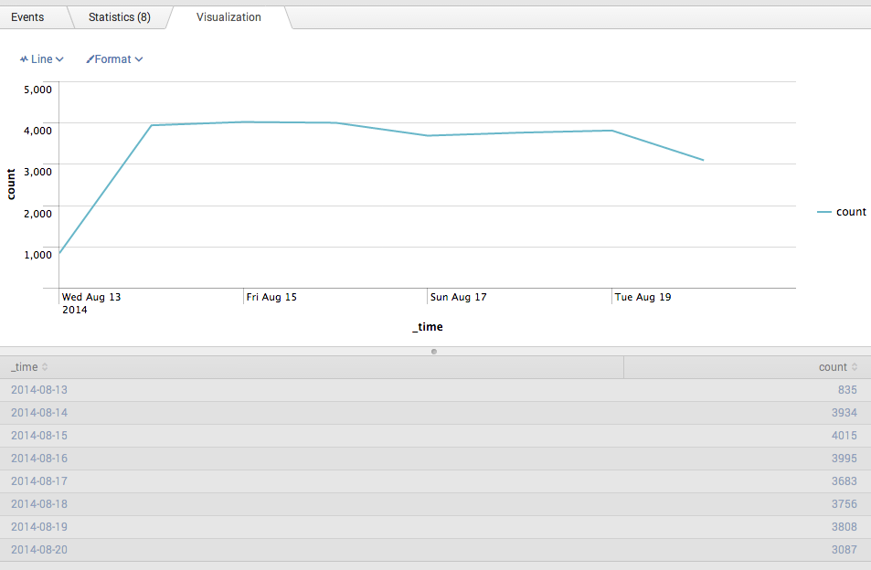

### 3.b. How does the number of unique visitors (IPs) change over time (days)?

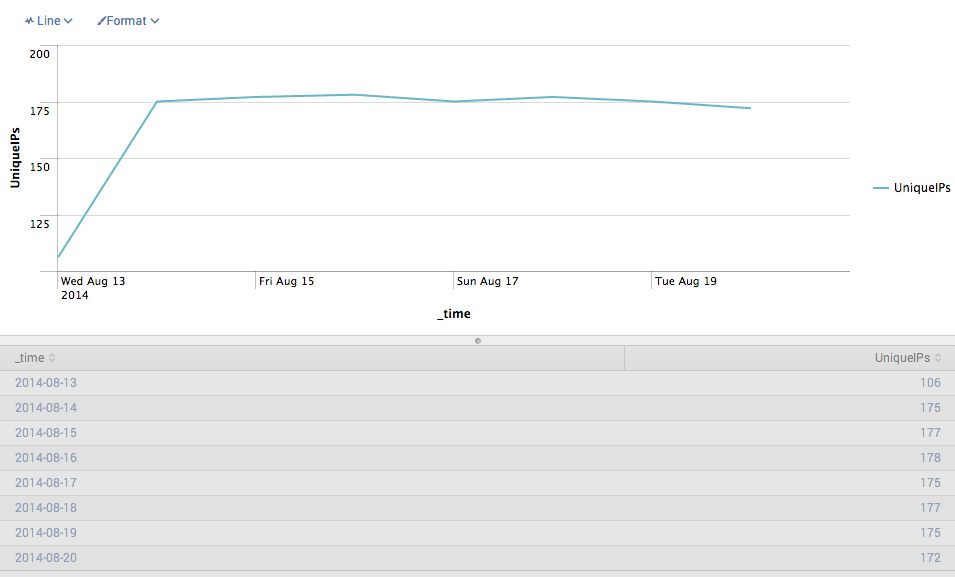

### 3.c. How does the number of unique visitors (IPs) change over time at a finer time-scale (hours)?

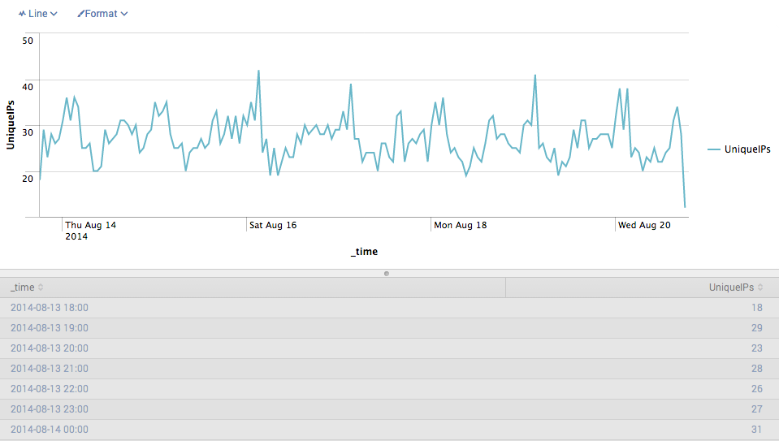

### 3.d. How does the distribution of product-related actions across the three hosts change over time, visualized as a _stacked area chart_?

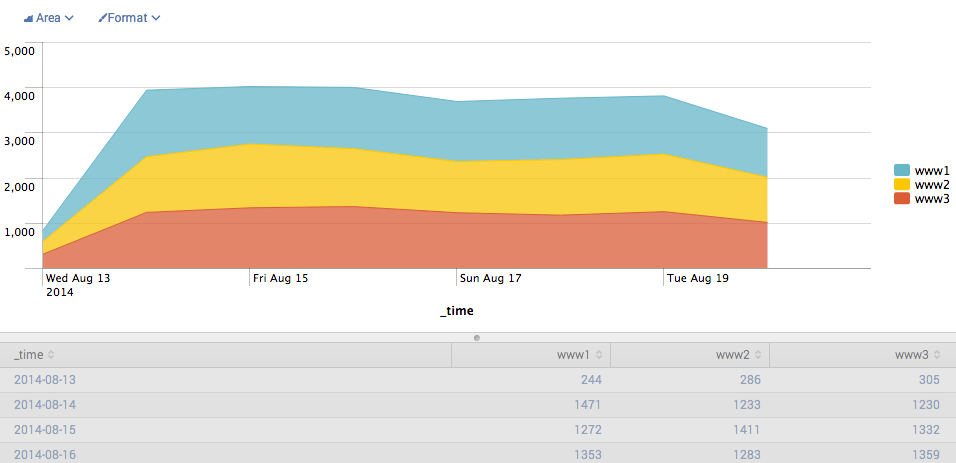

### 3.e. How does the distribution of actions across different products (i.e., productId) over time, visualized as a stacked area chart _normalized to 100%_?

Note: By default, only the 10 most frequent products are shown. The other are grouped into the OTHER category.

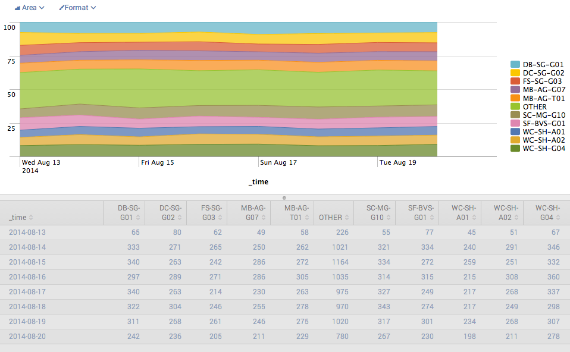

### 3.f. How can we answer the previous question but show all SIXTEEN products?

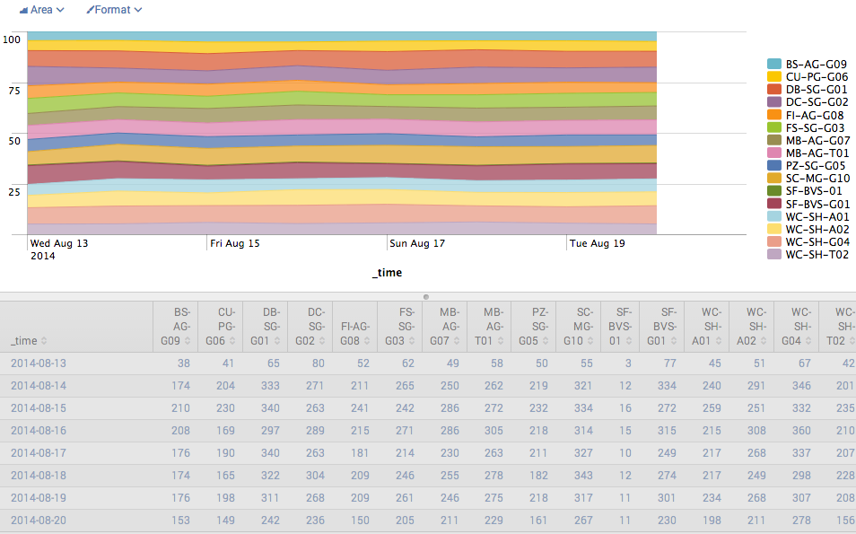

### 3.g. How does the distribution of visitors (clientip) change over time? 

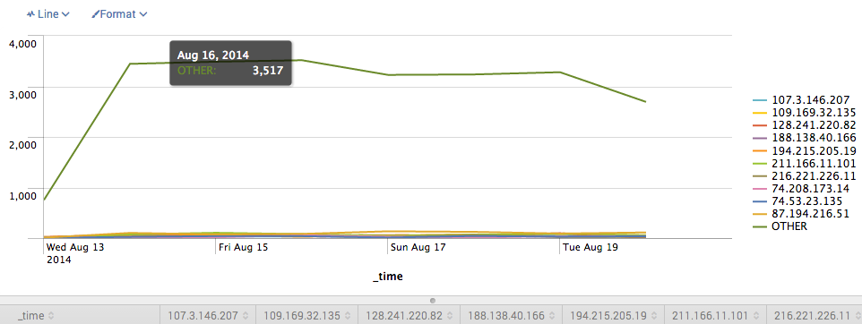

### 3.h. How can we improve the visualization by hiding the OTHER category and emphasize only the top 10?

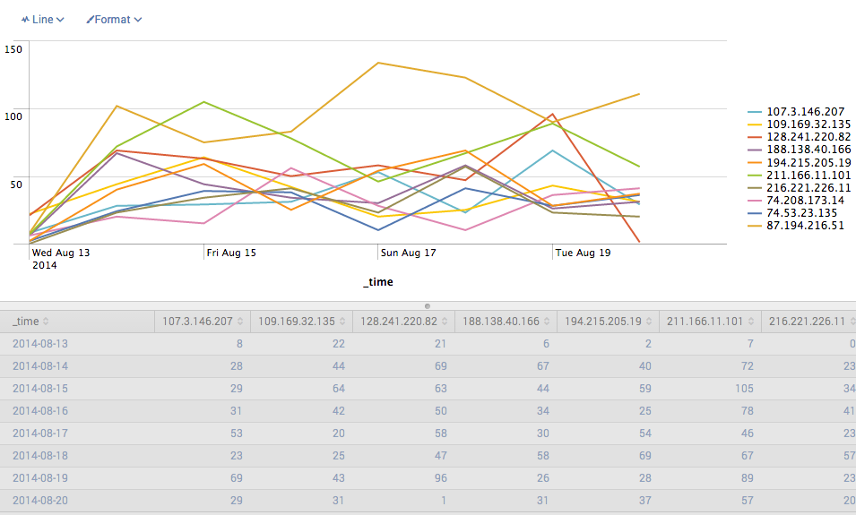

### 3.i. How does the traffic (as measured by sum(bytes)) change over time (in hours)? Where is the peak?

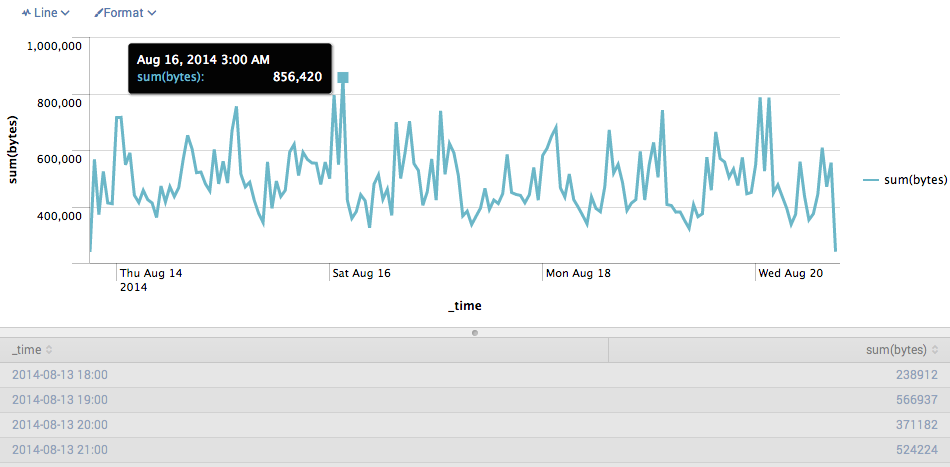

## Challenge 4: REX (4 points x 2 = 8 points)

Upon close examination, the values in the _action_ field may not be reliable. Some may be extracted incorrectly. 

Type this query in the search box:

	sourcetype=access_* action | table action, _raw

The results you will see may look like below:

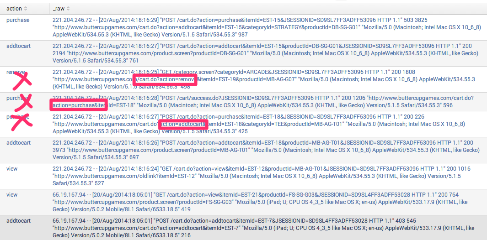

__raw_ is a special field to show the raw data, which are lines in the Apache server log. Note that in each line, there are two URL strings. The first URL string is a visitor's current request. The second URL string is the same visitor's previous request.

However, Splunk's automatic field extraction process operated on both URL strings when trying to extract the values for the action field. But it should've extracted only from the first URL string. You can see that in three cases (marked by X's), the value for the action parameter was extracted from the second URL string rather than the first URL string.

One solution to this problem is to define a custom field using a regular expression, using the REX command.

### 4.a. How to define a custom field to capture the HTTP request type? (4 points)

Here is the partially correct query to help you get started:

	sourcetype=access_* | rex "(?<mymethod>GET)" | 
	     table mymethod, method, _raw

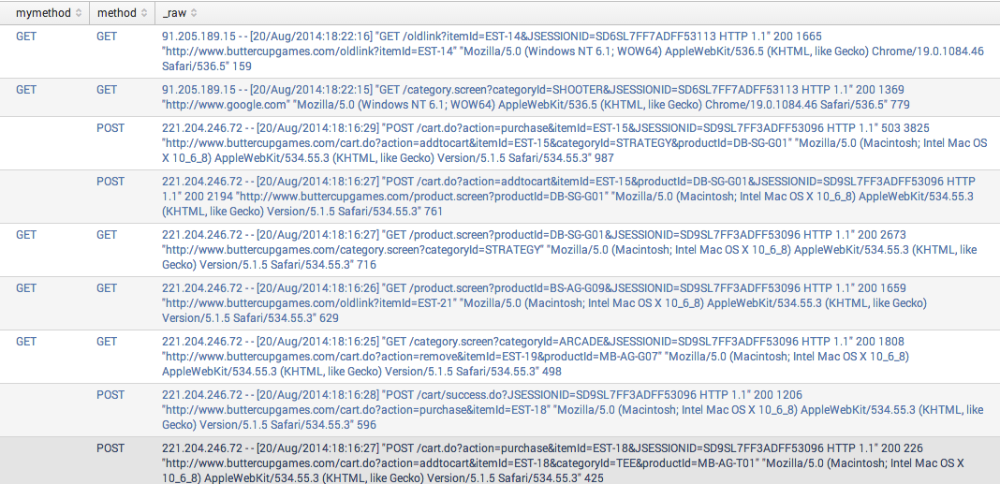

Note that only GET requests are correctly handled. Your objective is to modify the query in order to handle POST requests as well. The desired output is:

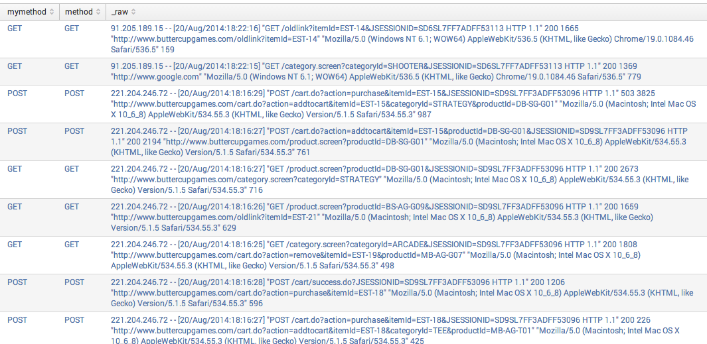

### 4.b. How to define a custom field to capture the action correctly? (4 points)

Here is the partially correct query to help you get started:

	sourcetype=access_* action | 
	    rex "(GET|POST) /cart.do\?action=(?<myaction>purchase)" |
	    table myaction, action, _raw

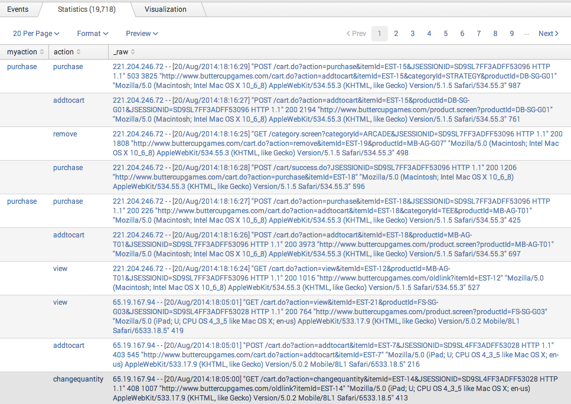

Note that this query only handles _purchase_ action. You will need to modify this query so that it handles all types of actions as well. In the table, the results are compared to those of the default action field. The custom _myaction_ field should correctly ignore actions embedded in the 2nd URL string.

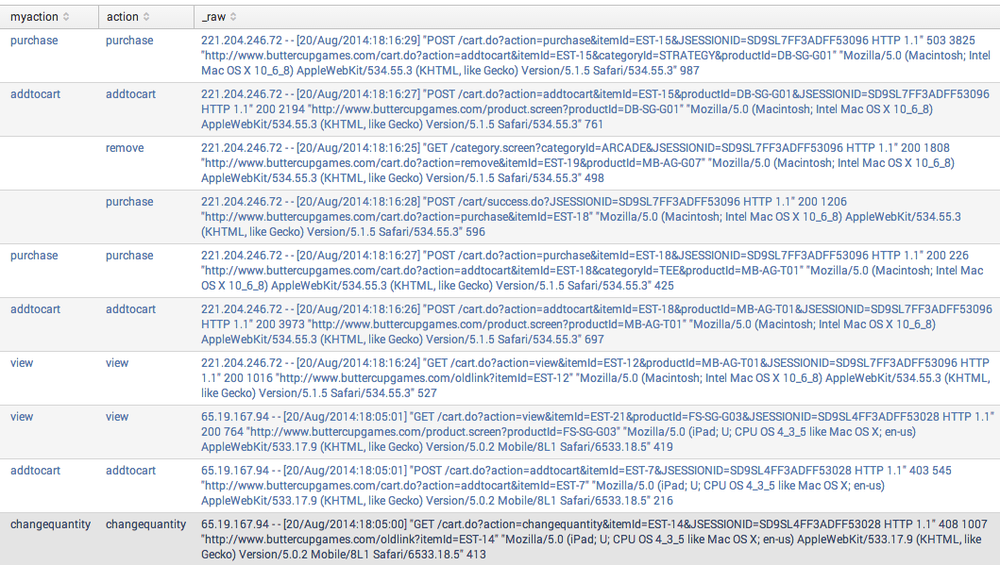

