(This is a part of [week 3's learning challenge](/challenges/3/))

# Challenges

## Challenge 1. Your Github events

Get a list of events performed by yourself by typing the following URL in a web browser. 

	https://api.github.com/users/[your-github-username]/events

By default, Github returns the most recent 30 events. Save the data as a file. Import the data into Splunk. Write a Splunk query to count the number of each event type. As you are experimenting, you may make mistakes and want to delete data. Find out how to do it by reading [this article](http://answers.splunk.com/answers/1484/how-do-i-delete-events). Note that you must figure out how to assign yourself the _can_delete_ role first.

### 1.a. How can you specify a field to extract timestamp?

In the Data Preview page, make sure you can get the timestamp for each event to be extracted correctly. When you see something like below, take a screenshot and submit.

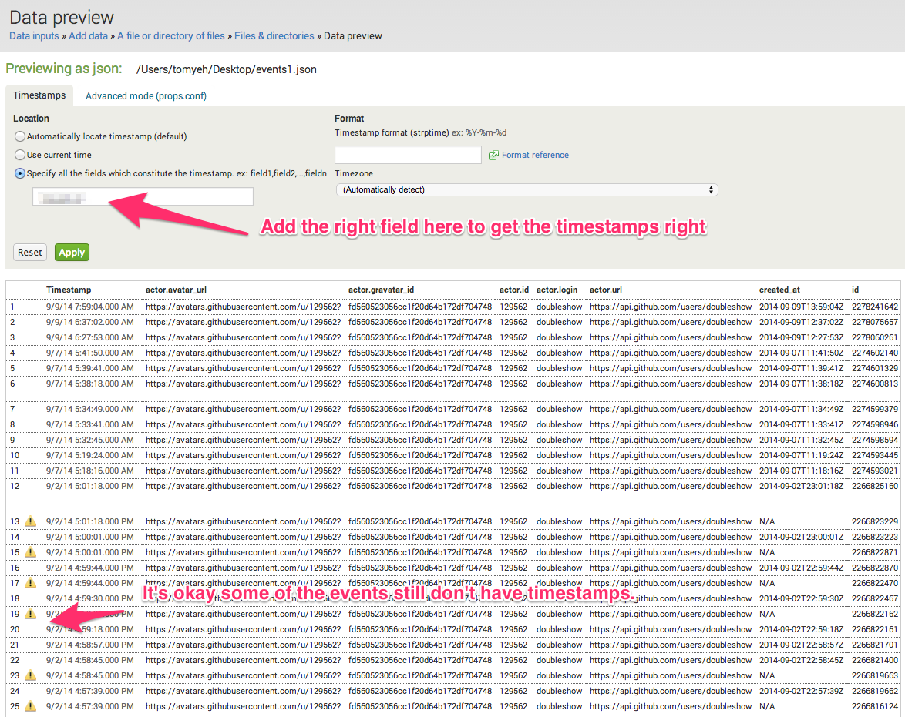

### 1.b. How can you define a custom source type?

Somewhere along the steps to import data, you can get to specify a custom source type name. See if you can name the source type as "[your_Github_username]_events" (e.g., doubleshow_events). Then, try the Spunk query to limit your search to this custom source type

	sourcetype=doubleshow_events

The desired result should look like below. Take a screenshot to submit.

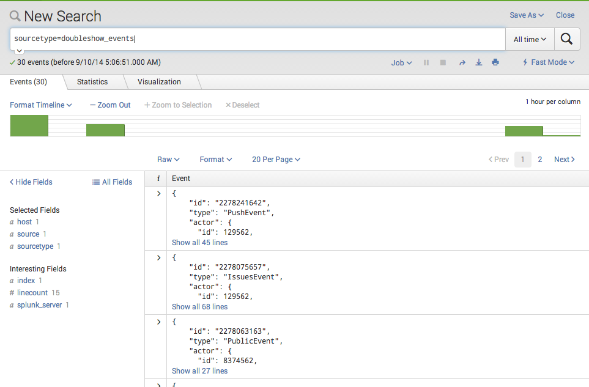

### 1.c. What is the distribution of event types?

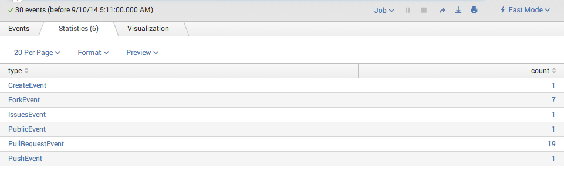

### 1.d. What is the timeline for your events by types?

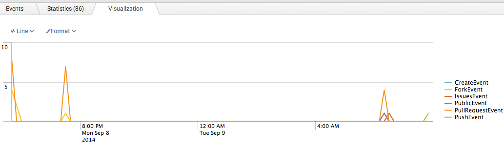

## Challenge 2. Our Class's Github Events

Download [300events.json](300events.json). This file contains 300 events pertinent to our course's Github organization (i.e., [https://github.com/CSCI-4830-002-2014/](https://github.com/CSCI-4830-002-2014/)). Import the data into Splunk. Make sure you give it a meaningful custom source type (e.g., course_github_events).

### 2.a. What is the distribution of push requests over Github accounts?

Inspect the JSON data of an event, you can see where to extrat the account name.

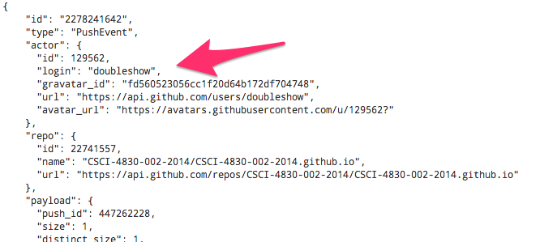

Figure out how you would specify a field name in a Splunk query to access this field. Your objective is to create a pie chart like this and take a screenshot to submit.
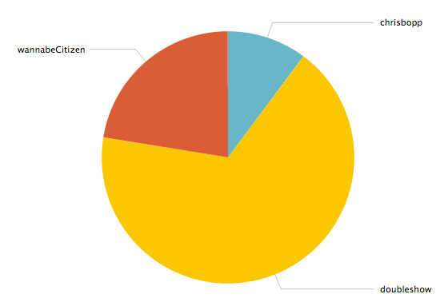

### 2.b. What are different event types compared over time for the whole class?

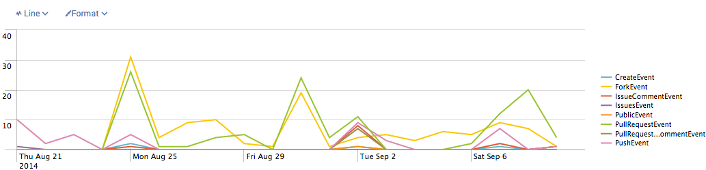

### 2.c. Who had the most number of pull request events?

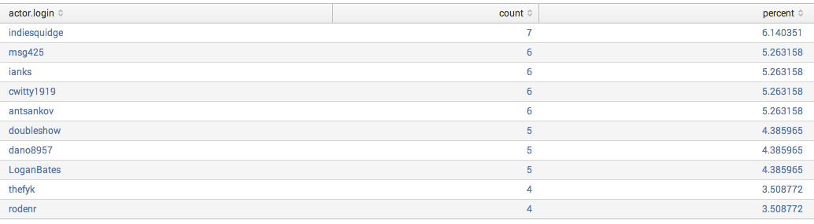

### 2.d. How many different kinds of pull request actions were made?

The JSON data of a pull request looks like this. Note the two fields you want to pay attention to.
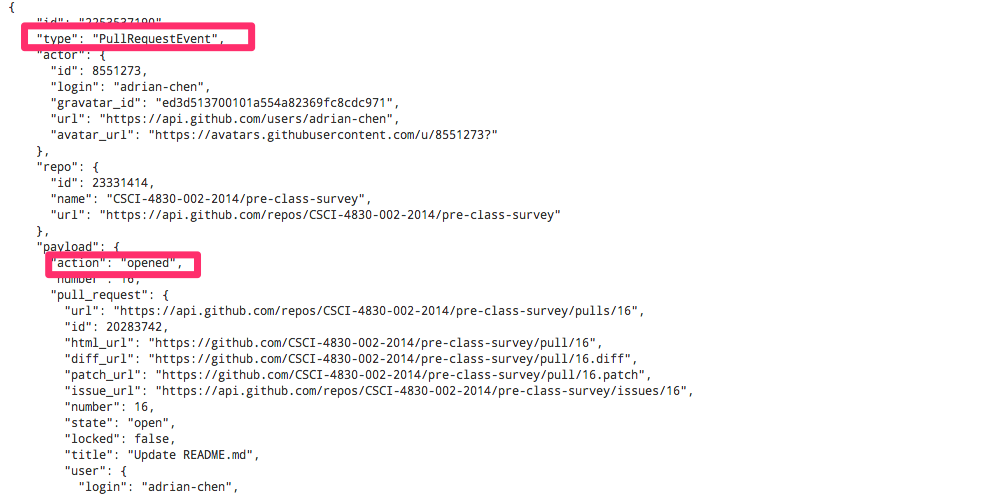

The result should look simialr to this. Take a screenshot and submit.
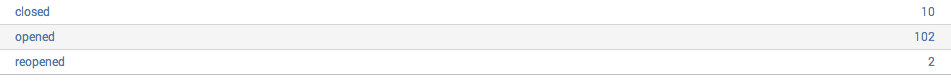

### 2.e. What is the distribution of opened pull requests over Github accounts?

Create pie chart like this and take a screenshot to submit.
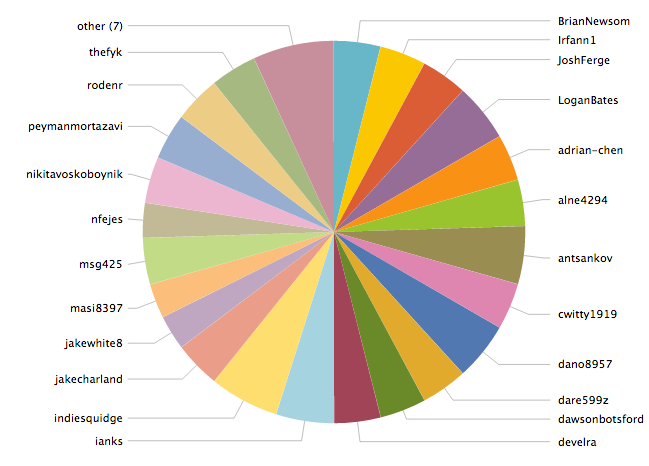

### 2.f. What is the submission pattern (i.e., pull requests) of the "Week 2 challenge" over time?

The JSON data of a typical week 2 submission looks like below.
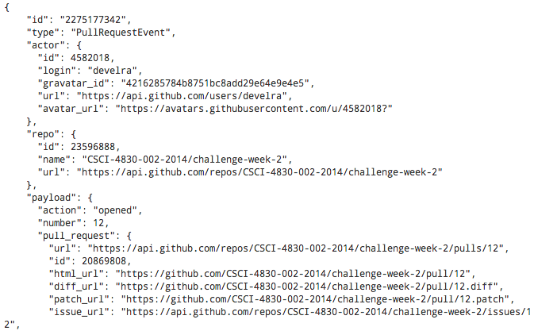

Think about how to add a search term to your query to match events like this. The desired outcome should look like below.
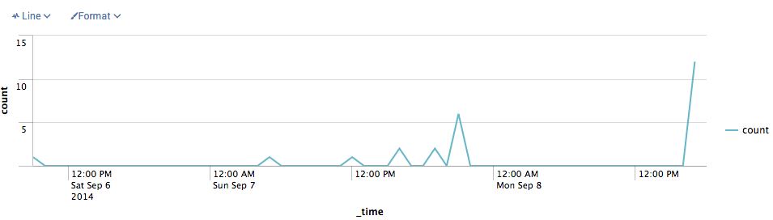
