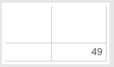

(This is a part of [week 5's learning challenge](/challenges/5/))

Learn [Tableau](http://www.tableausoftware.com/public/), the GUI-based visualization software that's becoming very popular for non-programmers.

Download from [here](http://www.tableausoftware.com/public/download).

# Checkpoints

## Checkpoint 1

Watch and learn from the video: [Introduction to Tableau Public](http://youtu.be/iT1iHLGawIM). You will need to download the dataset ["Cellphone Subscriptions - World Bank"](cellphone_data.xls) to follow along the tutorial video. At around [8 minutes 24 seconds](http://youtu.be/iT1iHLGawIM?t=8m24s) into this video, you should have created a dashboard that looks like below:

Change the title of this dashboard to include your name. Take a screenshot of your desktop and submit.

## Checkpoint 2

Watch and learn from the video: [Tableau Public: Intro to the Interface](https://www.youtube.com/watch?v=QZBvkLHZwZE). You will need to download the dataset ["Olympic Athletes Dataset"](OlympicAthletes_0.xlsx) to follow along the tutorial video. At around [4 minutes 57 seconds](http://youtu.be/QZBvkLHZwZE?t=4m57s) into this video, you should have created a dashboard that looks like below:

Add a title to this dashboard. The title should include your name. Take a screenshot of your desktop and submit.

## Checkpoint 3

Watch and learn from the video: [Maps - Dimensions and Measures](https://www.youtube.com/watch?v=NzSzB960elo). You will use the same dataset as above (i.e., ["Olympic Athletes Dataset"](OlympicAthletes_0.xlsx)). At around [3 minutes 47 seconds](http://youtu.be/QZBvkLHZwZE?t=3m36s) into this video, near the end, you should have created a dashboard that looks like below:

Add this sheet to the dashboard. Add a title including your name. Take a screenshot of your desktop and submit.

## Challenges

You will use the same dataset (Olympic Athletes Dataset) to answer 20 more challenge questions. For each challenge, look at the visualization and answer the question in your head. You do not need to write your answer down. Then, try to reproduce the visualization using Tableau. After you've succeeded, take a screenshot of your desktop to submit.

### 1. What is the oldest age?

### 2. What is the average age?

### 3. What is the average age by country?

### 4. What are some countries with the oldest athletes?

(same table, sorted by age in a descending order)

### 5. What is the distribution of ages of all athletes?

### 6. What were the years each athlete competed in?

### 7. How many different events each athlete competed in?

### 8. How many medals had each athlete won?

### 9. Who were among the athletes with the most number of medals won?

### 10. How many different sports?
(hint: measure, count, distinct )

### 11. What is the order of sports by the number of medals awarded?

### 12. What is the number of unique sports over the years?

### 13. What is the number of unique sports over only the summer Olympics years?

### 14. What sports had athletes from New Zealand won medals for? How many in each sport? 
(hint: athlete, count, highlight table)

### 15. How is the popularity of different sports compared, where big means popular?
(hint: athlete, count, packed bubbles)

### 16. Which sport had the oldest medalists on average, where darker green means old?

### 17. Which countries have won the most number of medals in swimming?

### 18. Which sport had medalists from the large number of different countries?

### 19. Among the sports that gave out a lot of medals (>100), which sports were the least represented by diverse countries?
(hint: filter, sort)

