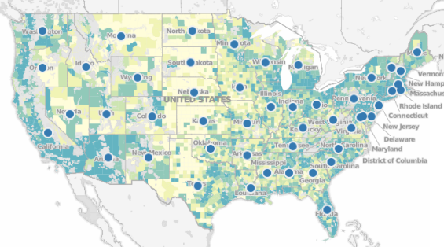
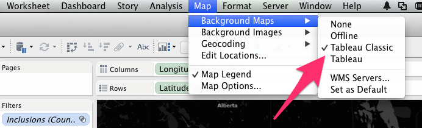
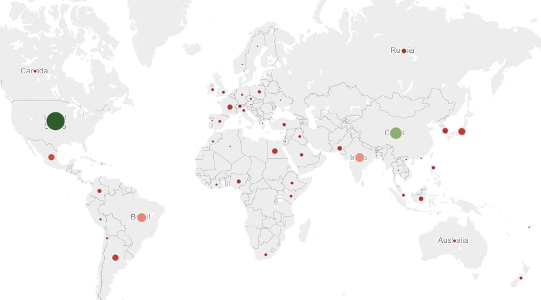
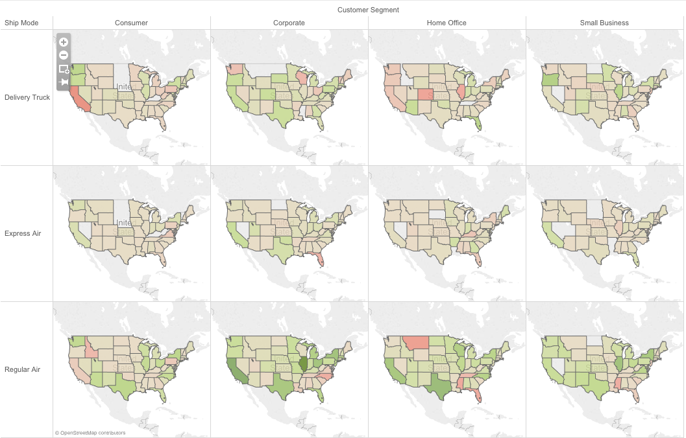
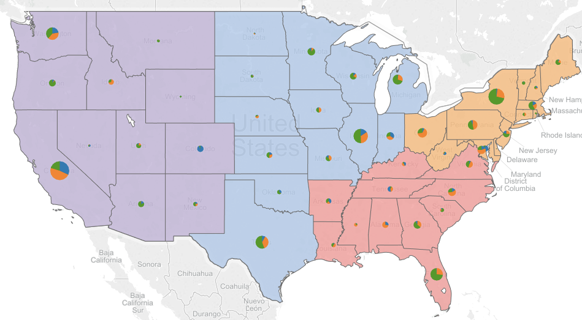
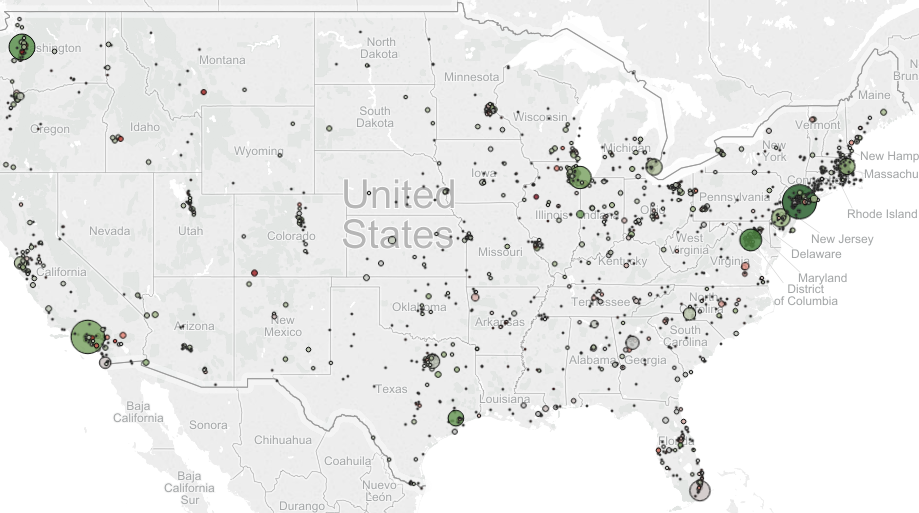
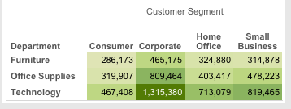
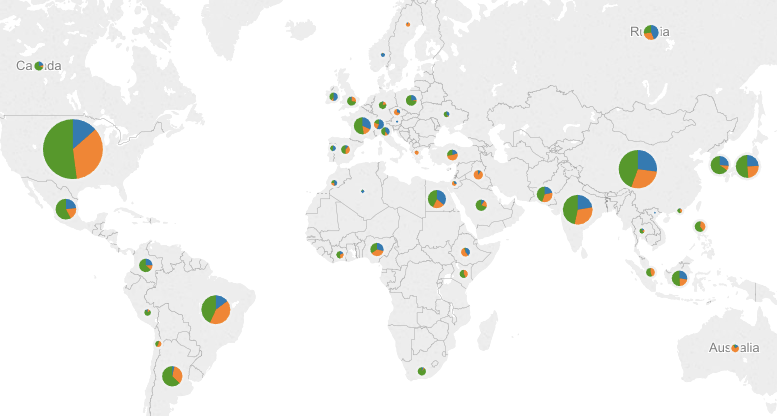
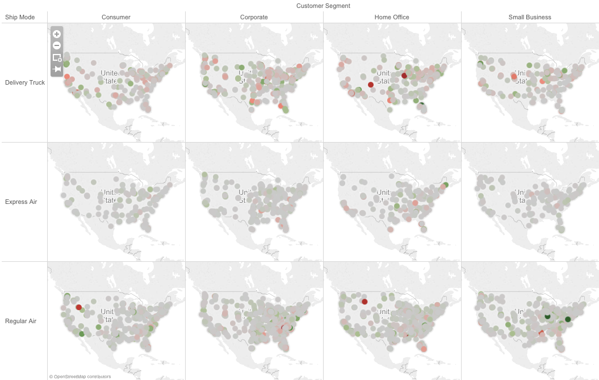
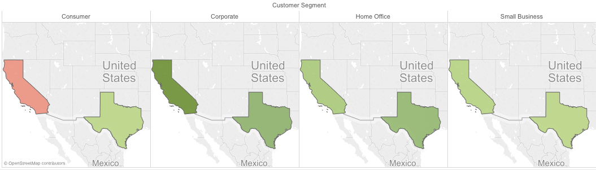

(This is a part of [week 6's learning challenge](/challenges/6/))

It is all about maps!

Download and install [Tableau Desktop](http://www.tableausoftware.com/products/desktop). This version requires a license. The free trial period is 14 days. Students can apply for a free one-year license on [this page](http://www.tableausoftware.com/academic/students).

Watch the [basic mapping](http://www.tableausoftware.com/learn/tutorials/on-demand/basic-mapping) tutorial video.

Use this dataset (the link below) as you follow along the tutorial:

| [Sample - Superstore - English (Extract)](Sample - Superstore - English (Extract).tds) |

You will need Tableau Desktop to be able to open this dataset file. Tableau Public doesn't allow you to open this file.

# Checkpoints

As you follow along the tutorial, you will create a series of visulizations. They may not look exactly the same as what is shown in the video because the dataset is slightly different.

# Checkpoint 1

When you are able to produce something similar to below, take a screenshot and submit.

Hint: You will need to select "Tableau Classic" map to get Data Layer to work.

# Checkpoint 2

When you are able to produce something similar to below, take a screenshot and submit.

# Checkpoint 3

When you are able to produce something similar to below, take a screenshot and submit.

# Checkpoint 4

When you are able to produce something similar to below, take a screenshot and submit.

# Challenges

### 1. Which cities generated relatively big sales figures but not making money (name two?)

* Cities: Map
* Sales: Area
* Profits: Color

Reproduce the visualization above as close as possible to support your answer.

### 2. Which combination of customer segment and department generated the highest total profit?

Reproduce the visualization above as close as possible to support your answer.

### 3. Which countries were similar to Egypt in terms of total sales but had trouble turning a profit in one department (i.e., technology, office supplies, or furniture) (name two)?

* States: Map
* Sales: Size
* Categories: Pie/Color

Reproduce the visualization above as close as possible to support your answer.

### 4. Consider various combinations of customer segment and ship mode, which cities had been losing significant money with respect to a particular combination? 

* Cities: Map
* Profits: Color

Reproduce the visualization above as close as possible to support your answer.

### 5. In which customer segment did Texas significantly outperform California in terms of total profits?

Reproduce the visualization above as close as possible to support your answer.

### 6. Average shipping cost

Your boss suspected that the company is paying way too much on average for shipping by truck in some states (US) compared to the others. Yes or no? Make your own visualization to support your answer.

### 7. Average profits 

Your boss wanted to know in what aspects Colorado's market is different from that of the other states.However, he is only interested in comparing Colorado to its peers in terms of market size (measured by total sales). He doesn't want to compare apples to oranges. What will you show to the boss? Make your own visualization to support your answer.

Hints: Some sub-questions you need to answer first.

* What is the total sales of Colorado?
* What other states had similar sales (pick 4)?
* Along what measures these states may differ?
* Along what dimensions these states may differ?
* Where does Colorado jump out as unique visually (e.g., the greenest, the biggest, the only red ... etc)?

